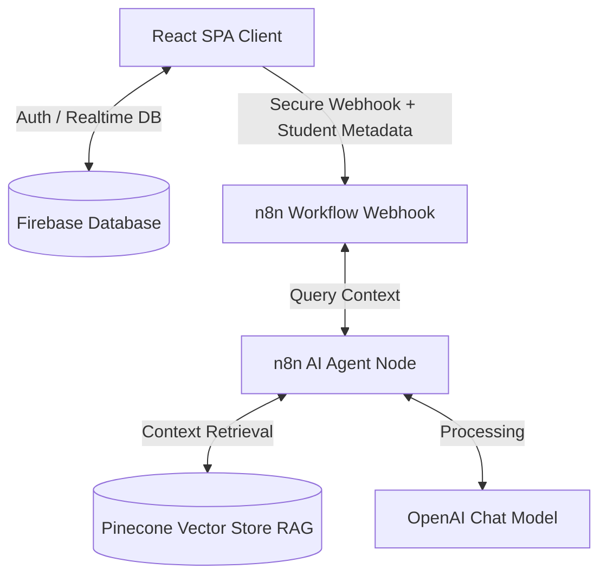

# IT Assistant

ระบบวางแผนการเรียนและช่วยเหลือข้อมูลหลักสูตร คณะเทคโนโลยีสารสนเทศ มหาวิทยาลัยเทคโนโลยีพระจอมเกล้าพระนครเหนือ (KMUTNB)

---

## 🔍 ภาพรวมระบบ (System Architecture)

ระบบประกอบด้วยเว็บแอปพลิเคชัน (React + TypeScript) ทำหน้าที่จัดการข้อมูลโครงสร้างการเรียน ดึงข้อมูลประวัติส่วนตัวและแผนการเรียนจาก Firebase Realtime Database ส่งต่อไปยังระบบประมวลผลคำถามด้วย AI Agent ผ่าน n8n Webhook และค้นหาเงื่อนไขรายวิชาด้วย Pinecone Vector Database (RAG)



---

## ⚡ คุณลักษณะสำคัญ (Core Features)

### 1. ระบบจัดการแผนการเรียนส่วนบุคคล
- **Interactive Study Plan:** วางแผนรายวิชาเรียน ติดตามความก้าวหน้ารายเทอมและรายปี
- **Academic Calculator:** คำนวณเกรดเฉลี่ยสะสม (GPA) และยอดสะสมหน่วยกิตอัตโนมัติตามเกณฑ์สถาบัน
- **Dynamic Status Tracking:** บันทึกสถานะรายวิชาแบบละเอียด (วางแผนเรียน, กำลังศึกษา, ผ่านแล้ว, ไม่ผ่าน หรือถอนรายวิชา)

### 2. แผนภูมิโครงสร้างหลักสูตร (Curriculum Flowchart)
- **Visual Chart Configurations:** แสดงรายวิชาในรูปแบบตารางเรียนมาตรฐาน (Grid View) หรือไทม์ไลน์ความสัมพันธ์ (Timeline View)
- **Interactive Prerequisite Lines:** แสดงเส้นเชื่อมโยงวิชาบังคับก่อนหน้า (Prerequisites) และวิชาเรียนควบคู่ (Corequisites) แบบ Visual

### 3. ระบบแชทบอทอัจฉริยะ (n8n AI Assistant & Firebase Integration)
- **Context-Aware Responses:** บอทรับข้อมูลโปรไฟล์นักศึกษาและเกรดเฉลี่ยสะสมแบบ Real-time เพื่อตอบคำถามประวัติการเรียนส่วนตัว
- **Automated Curriculum Comparison:** เปรียบเทียบแผนการเรียนจริงของนักศึกษากับหลักสูตรมาตรฐาน เพื่อหาและรายงานรายวิชาบังคับที่ยังไม่ได้ศึกษา
- **Role-Based Security Guard:** กรองสิทธิ์การเข้าถึงข้อมูลรายวิชา หากเป็นผู้เยี่ยมชม (Guest Mode) ระบบจะจำกัดการดูข้อมูลส่วนตัว และค้นหาข้อมูลวิชาเรียนทั่วไปผ่าน Pinecone RAG เท่านั้น

---

## 👥 ตารางสิทธิ์เข้าใช้งานระบบ (Role & Permissions Matrix)

| บทบาทผู้ใช้ (Role) | สิทธิ์การทำงานหลัก |
| :--- | :--- |
| **นักศึกษา (Student)** | - จัดการแผนการเรียนส่วนตัว<br>- บันทึกปีการศึกษาและข้อมูลรายวิชาเรียนผ่าน<br>- ใช้งานแชทบอท AI แบบรู้จำข้อมูลส่วนตัว |
| **อาจารย์ (Instructor)** | - เข้าถึงรายชื่อและข้อมูลนักศึกษาที่รับผิดชอบ<br>- ติดตามความก้าวหน้าแผนการเรียนและแก้ไขสถานะข้อมูลนักศึกษา |
| **บุคลากร (Staff)** | - บริหารจัดการโครงสร้างรายวิชาส่วนกลาง<br>- กำหนดเงื่อนไขวิชาเรียน (Prerequisites/Corequisites) |
| **ผู้ดูแลระบบ (Admin)** | - ตรวจสอบความปลอดภัยระบบผ่านระบบ Audit Logs<br>- บริหารจัดการบัญชีผู้ใช้งานและจัดการสิทธิ์ทั้งหมด |

---

## 🛠️ เทคโนโลยีที่ใช้ (Tech Stack)

### หน้าบ้าน (Frontend)
- **Core:** React 18, TypeScript, Vite
- **Styling:** Tailwind CSS, shadcn/ui (Radix UI)
- **Routing & State:** React Router DOM, TanStack React Query (React Query v5)
- **Visualization & Export:** Recharts, html2canvas, jsPDF

### หลังบ้าน (Backend & Database)
- **Database & Auth:** Firebase Authentication, Firebase Realtime Database
- **Hosting:** Firebase Hosting

### ระบบ AI & Chatbot
- **Workflow Automation:** n8n Workflow Webhook
- **Vector Database:** Pinecone Vector Store (RAG)
- **LLM Engine:** OpenAI Chat Model (`gpt-5-nano` / `gpt-4o-mini`)

---

## 🚀 การติดตั้งและใช้งาน (Installation Guide)

### ข้อกำหนดเบื้องต้น (Prerequisites)
- **Node.js** (เวอร์ชัน 18 ขึ้นไป)
- **Firebase Project** ที่เปิดใช้งาน Realtime Database และ Authentication
- **n8n Webhook URL** (สำหรับการใช้แชทบอท AI)

### ขั้นตอนการทำงาน

1. **ดาวน์โหลดโครงการและติดตั้ง Dependencies**
   ```bash
   git clone <repository-url>
   cd it-course-chatbot-main
   npm install
   ```

2. **ตั้งค่าไฟล์สภาพแวดล้อม (Environment Variables)**
   สร้างไฟล์ `.env` ไว้ที่โฟลเดอร์หลัก (Root Directory) และระบุข้อมูลดังนี้:
   ```env
   VITE_FIREBASE_API_KEY=your_firebase_api_key
   VITE_FIREBASE_AUTH_DOMAIN=your_firebase_auth_domain
   VITE_FIREBASE_DATABASE_URL=your_firebase_database_url
   VITE_FIREBASE_PROJECT_ID=your_firebase_project_id
   VITE_FIREBASE_STORAGE_BUCKET=your_firebase_storage_bucket
   VITE_FIREBASE_MESSAGING_SENDER_ID=your_firebase_messaging_sender_id
   VITE_FIREBASE_APP_ID=your_firebase_app_id
   VITE_N8N_WEBHOOK_URL=your_n8n_chat_webhook_url
   ```

3. **นำเข้าข้อมูลหลักสูตรเริ่มต้นสู่ Firebase**
   ```bash
   node initialize-firebase-data.cjs
   ```

4. **เริ่มการทำงานระบบสำหรับพัฒนาพัฒนา (Local Development)**
   ```bash
   npm run dev
   ```
   *ระบบจะเปิดใช้งานที่ URL: `http://localhost:5173`*

5. **การตรวจสอบและสร้างไฟล์โปรดักชัน (Production Build)**
   ```bash
   npm run lint   # ตรวจสอบความถูกต้องของโค้ด
   npm run build  # คอมไพล์ไฟล์สำหรับ Production
   ```

---

## 📁 โครงสร้างโฟลเดอร์ที่สำคัญ (Key Directory Structure)

```text
src/
├── components/          # ส่วนประกอบอินเทอร์เฟซหลัก
│   ├── chat/            # หน้าต่างอินเทอร์เฟซแชทบอท (ChatBot.tsx)
│   ├── curriculum/      # หน้าแสดงแผนผังวิชาเรียนแบบ Grid และ Timeline
│   ├── dashboard/       # แดชบอร์ดตามบทบาทผู้ใช้งาน (Student, Instructor, Staff, Admin)
│   └── study-plan/      # ส่วนจัดการและบันทึกผลแผนการเรียน
├── contexts/            # ระบบสเตตและจัดการการล็อกอิน (AuthContext.tsx)
├── hooks/               # ตัวดึงข้อมูลความสัมพันธ์ของนักศึกษาและเกรดเฉลี่ย (useFirebaseData.ts)
├── services/            # บริการ API เชื่อมโยงข้อมูล Firebase และ Hybrid Course
└── types/               # การกำหนดชนิดตัวแปรและข้อมูล (Types)
```

---

## 🔒 กฎความมั่นคงปลอดภัย (Security Policies)
- จำกัดสิทธิ์การสมัครและเข้าใช้งานเฉพาะอีเมลภายใต้โดเมนสถาบัน `@kmutnb.ac.th` และ `@email.kmutnb.ac.th` เท่านั้น
- มีการเข้ารหัสและตรวจสอบตัวตนผ่าน Firebase Authentication ทุกเซสชัน
- บันทึกพฤติกรรมการเขียนหรือแก้ไขฐานข้อมูลวิชาผ่าน Audit Logs

---

## 🔧 การแก้ไขข้อผิดพลาดและปรับปรุงระบบ (Bug Fixes & Improvements)

### Security

| # | รายละเอียด | ไฟล์ที่แก้ไข |
|---|-----------|-------------|
| BUG-01 | `setUser()` ไม่ได้ inject `id` จาก Firebase key ทำให้ `user.id` เป็น `undefined` ทั่วระบบ | `AuthContext.tsx` |
| BUG-02 | `Date` object ถูก serialize เป็น `{}` ใน Firebase — เปลี่ยนเป็น `.toISOString()` | `AuthContext.tsx` |
| BUG-03 | `delete userWithTimestamp.password` ไม่ work ใน strict TypeScript — แก้เป็น destructure | `firebaseService.ts` |
| BUG-04 | prop `requiredRoles` (array) ไม่มีใน interface ของ `ProtectedRoute` ทำให้ role check ไม่ทำงาน (authorization bypass) | `ProtectedRoute.tsx` |
| BUG-11 | แสดง raw Firebase error message ต่อผู้ใช้โดยตรง — เปลี่ยนเป็น message ภาษาไทยที่ปลอดภัย | `Login.tsx` |

### Performance

| # | รายละเอียด | ไฟล์ที่แก้ไข |
|---|-----------|-------------|
| BUG-07 | เรียก `getCourses()` 2 ครั้งแบบ sequential ต่อ semester — เปลี่ยนเป็น `Promise.all()` parallel | `hybridCourseService.ts` |

### Stability / UX

| # | รายละเอียด | ไฟล์ที่แก้ไข |
|---|-----------|-------------|
| BUG-05 | `createChat()` ถูกเรียกซ้ำทุกครั้งที่ `studyPlan` / `gpaData` เปลี่ยน — ใช้ `useRef` guard | `ChatBot.tsx` |
| BUG-08 | `isLoading` ค้าง `true` หลัง login สำเร็จจนปุ่ม disabled — เพิ่ม `setIsLoading(false)` ก่อน toast | `AuthContext.tsx` |
| BUG-09 | Hook `useStudyPlan` / `useStudentGPAAndCredits` รับ `undefined` แทน `string` | `StudentDashboard.tsx` |
| BUG-10 | Pagination คำนวณ `Math.ceil(n / 0)` → `Infinity` — เพิ่ม guard `effectiveLimit` | `firebaseService.ts` |
| BUG-12 | `initializeApp('admin-app')` crash ใน Vite HMR เมื่อ module reload ซ้ำ | `firebaseService.ts` |
| BUG-13 | ดึงข้อมูลวิชา IT ปะปนในแผนการเรียนของนักศึกษา INE — เพิ่มระบบกรองตามหลักสูตรและสาขาวิชา | `firebaseService.ts`, `StudyPlanManager.tsx` |
| BUG-14 | แสดงสถานะวิชาเรียนไม่ผ่านเป็น "วางแผนเรียน" และนับรายวิชาที่มีเกรด F/U เป็นวิชาที่เรียนผ่านสำเร็จ — ปรับปรุงระบบ Badge แสดงผล แยกระดับเกรด และซิงค์สถานะเกรดตกอัตโนมัติ | `StudyPlanManager.tsx`, `prerequisiteUtils.ts`, `StudentDashboard.tsx`, `StudentDetailView.tsx` |

### UI / Branding

| รายละเอียด | ไฟล์ที่แก้ไข |
|-----------|-------------|
| ปรับปรุงสี Badge แสดงสถานะแผนการเรียนด้วยชุดสีพาสเทลพรีเมียม (พาสเทลเขียว, ส้ม, แดง, ฟ้า) | `StudyPlanManager.tsx` |
| เปลี่ยน favicon จาก Lovable เป็น icon ธีม IT/Bot ใหม่ | `index.html`, `public/favicon-it.jpg` |
| ลบ Lovable branding ออกจาก meta tags ทั้งหมด | `index.html` |
| แก้ footer ทับ chatbot toggle — เพิ่ม `padding-right` | `Footer.tsx` |
| ลบ GitHub icon ออกจาก footer | `Footer.tsx` |
| อัปเดต ExternalLink ใน footer ให้ชี้ไป `https://www.fitm.kmutnb.ac.th/` | `Footer.tsx` |
| ย้าย Toast notification (shadcn + Sonner) จาก bottom-right → bottom-left ไม่ทับ chatbot toggle | `toast.tsx`, `App.tsx` |