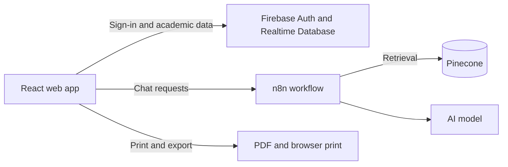

<div align="center">

# IT Assistant

**ผู้ช่วยวางแผนการเรียนและค้นหาข้อมูลหลักสูตร**<br />
ระบบสำหรับนักศึกษาและบุคลากร ภาควิชาเทคโนโลยีสารสนเทศ<br />
คณะเทคโนโลยีและการจัดการอุตสาหกรรม · มหาวิทยาลัยเทคโนโลยีพระจอมเกล้าพระนครเหนือ

[เริ่มใช้งาน](#เริ่มต้นใช้งาน) · [คุณสมบัติ](#คุณสมบัติ) · [เทคโนโลยี](#เทคโนโลยี) · [การพัฒนา](#การพัฒนาในเครื่อง)

</div>

---

## ภาพรวม

IT Assistant เป็นเว็บแอปสำหรับสำรวจหลักสูตร จัดทำแผนการเรียน ติดตามหน่วยกิตและผลการเรียน พร้อมแชทบอทช่วยตอบคำถามด้านหลักสูตรและการลงทะเบียน อินเทอร์เฟซรองรับภาษาไทยและออกแบบตาม CI โทนกรมท่า น้ำเงิน และขาว



## คุณสมบัติ

| พื้นที่ | ความสามารถ |
| --- | --- |
| หลักสูตร | ค้นหาและกรองรายวิชา ดูรายละเอียด เงื่อนไขวิชา และแผนผังหลักสูตร |
| แผนการเรียน | จัดวิชาตามปีและภาคเรียน ตรวจสอบวิชาบังคับก่อน และติดตามสถานะการเรียน |
| ผลการเรียน | สรุปหน่วยกิตและ GPA พร้อมรายงานที่พิมพ์หรือส่งออกเป็น PDF ได้ |
| แชทบอท | ถามข้อมูลหลักสูตรและการเรียนผ่าน workflow ที่เชื่อมกับแหล่งความรู้ของภาควิชา |
| เครื่องมือบุคลากร | จัดการข้อมูลรายวิชา เงื่อนไข และบัญชีตามสิทธิ์ที่ได้รับ |
| วิเคราะห์การใช้งาน | ดูสถิติและส่งออกข้อมูลการสนทนาสำหรับผู้มีสิทธิ์ |
| Responsive UI | ใช้งานเมนูและหน้าหลักบนมือถือ แท็บเล็ต และเดสก์ท็อป |

## บทบาทผู้ใช้

| บทบาท | การใช้งานหลัก |
| --- | --- |
| นักศึกษา | จัดการแผนการเรียนและดูความก้าวหน้าของตนเอง |
| อาจารย์ | ติดตามและให้คำปรึกษาแผนการเรียนของนักศึกษาในความดูแล |
| บุคลากร | จัดการรายวิชาและเงื่อนไขหลักสูตร |
| ผู้ดูแลระบบ | จัดการผู้ใช้และดูแลเครื่องมือบริหารระบบ |

## เทคโนโลยี

- **Web:** React 18, TypeScript, Vite
- **UI:** Tailwind CSS 3, shadcn/ui, Radix UI, Lucide
- **Routing and state:** React Router, TanStack Query
- **Identity and data:** Firebase Authentication, Realtime Database
- **AI workflow:** n8n, Pinecone retrieval, configured language model
- **Reports:** jsPDF, html2canvas, SheetJS

## เริ่มต้นใช้งาน

### ต้องมี

- Node.js 18 ขึ้นไป
- Firebase project ที่เปิด Firebase Authentication และ Realtime Database
- n8n workflow URL สำหรับใช้งานแชทบอท

### ติดตั้งและตั้งค่า

```bash
git clone <repository-url>
cd it-course-chatbot-main
npm ci
```

คัดลอก `.env.example` เป็น `.env` แล้วใส่ค่า Firebase และ n8n สำหรับ environment ของคุณ:

```bash
# macOS / Linux
cp .env.example .env

# Windows PowerShell
Copy-Item .env.example .env
```

ตัวแปรที่ใช้กับเว็บมี `VITE_FIREBASE_API_KEY`, `VITE_FIREBASE_AUTH_DOMAIN`, `VITE_FIREBASE_DATABASE_URL`, `VITE_FIREBASE_PROJECT_ID`, `VITE_FIREBASE_STORAGE_BUCKET`, `VITE_FIREBASE_MESSAGING_SENDER_ID`, `VITE_FIREBASE_APP_ID` และ `VITE_N8N_WEBHOOK_URL`; `VITE_N8N_SUMMARY_WEBHOOK_URL` ใช้เมื่อตั้งค่า workflow สรุปข้อมูล

> เก็บค่าจริงไว้ในไฟล์ `.env` เฉพาะเครื่องและอย่า commit ไฟล์นี้ ตรวจ project ID และ database URL ให้ตรงกับ environment ก่อนเริ่มแอป โดยเฉพาะก่อนทำรายการเขียนข้อมูล

### รันเว็บ

```bash
npm run dev
```

เปิด URL ที่ Vite แสดงใน terminal (โดยปกติคือ `http://localhost:8080`).

### สร้าง Production build

```bash
npm run lint
npm run build
```

## การพัฒนาในเครื่อง

### Firebase Emulator

ใน repository มีการตั้งค่า Emulator สำหรับ Authentication และ Realtime Database ที่ผูกกับ `127.0.0.1`:

```bash
npm run firebase:emulators
```

อีก terminal ให้เริ่มเว็บด้วย test mode:

```bash
npm run dev:emulator
```

การรันเว็บใน test mode ต้องมี `.env.test` ที่ใช้ project ID รูปแบบ `demo-*` และตั้ง Firebase Emulator flag ตาม configuration ของ repository แอปจะปฏิเสธ test mode หากไม่มี Emulator flag หรือ project ID ไม่ใช่ demo project; ตรวจไฟล์ตั้งค่าก่อนเริ่ม และอย่าใส่ credentials ของ production ใน `.env.test`.

### เอกสารเพิ่มเติม

- [คู่มือเตรียม n8n workflow](N8N_PREREQUISITES_GUIDE.md)
- [แผนตรวจ Firebase CRUD และหน่วยกิต](docs/superpowers/plans/2026-09-12-firebase-crud-audit.md)
- [ผลตรวจ Firebase CRUD](docs/audits/firebase-crud-credit-audit.md)
- [แผน responsive navigation และ Student QA](docs/superpowers/plans/2026-09-12-mobile-navigation-student-qa.md)
- [ผลทดสอบ responsive navigation และ Student QA](docs/audits/mobile-navigation-student-qa.md)

## โครงสร้างโครงการ

```text
src/
├── components/       # หน้าจอและคอมโพเนนต์ UI
│   ├── chat/         # แชทบอท
│   ├── curriculum/   # แผนผังหลักสูตร
│   ├── dashboard/    # แดชบอร์ดตามบทบาท
│   ├── layout/       # Header และ Footer
│   └── study-plan/   # แผนการเรียนและรายงาน
├── contexts/         # สถานะการยืนยันตัวตน
├── hooks/            # React hooks
├── pages/            # route ของแอป
├── services/         # Firebase และบริการข้อมูล
├── types/            # TypeScript models
└── utils/            # ฟังก์ชันช่วยและการส่งออกรายงาน
```

## ความปลอดภัยและข้อมูลส่วนบุคคล

- การสมัครจำกัดอีเมลตามโดเมนที่ระบบกำหนด
- Firebase Authentication ใช้ยืนยันตัวตน; Firebase Realtime Database Rules ควบคุมการเข้าถึงข้อมูล
- อย่าใส่รหัสผ่าน, token, service account key หรือข้อมูลส่วนบุคคลใน source code, issue หรือ commit
- ใช้ Firebase Emulator สำหรับทดสอบการเขียนและลบข้อมูล; ยืนยันปลายทางทุกครั้งก่อนทดสอบกับ project จริง
- จัดการข้อมูลการสนทนาและข้อมูลนักศึกษาตามนโยบายความเป็นส่วนตัวของหน่วยงาน

---

<div align="center">

ภาควิชาเทคโนโลยีสารสนเทศ · KMUTNB

</div>
