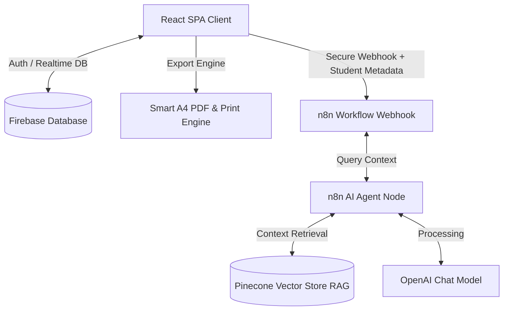

# IT Assistant

ระบบวางแผนการเรียนและช่วยเหลือข้อมูลหลักสูตร คณะเทคโนโลยีและการจัดการอุตสาหกรรม ภาควิชาเทคโนโลยีสารสนเทศ มหาวิทยาลัยเทคโนโลยีพระจอมเกล้าพระนครเหนือ (KMUTNB)

---

## 🔍 ภาพรวมระบบ (System Architecture)

ระบบประกอบด้วยเว็บแอปพลิเคชัน (React + TypeScript) ทำหน้าที่จัดการข้อมูลโครงสร้างการเรียน ดึงข้อมูลประวัติส่วนตัวและแผนการเรียนจาก Firebase Realtime Database ส่งต่อไปยังระบบประมวลผลคำถามด้วย AI Agent ผ่าน n8n Webhook และค้นหาเงื่อนไขรายวิชาด้วย Pinecone Vector Database (RAG) พร้อมระบบสร้างรายงานแผนการศึกษาและส่งออกเอกสาร PDF มาตรฐานทางการ



---

## ⚡ คุณลักษณะสำคัญ (Core Features)

### 1. ระบบจัดการแผนการเรียนส่วนบุคคล (Interactive Study Plan Manager)
- **2-Level Tabs & Side-by-Side Semesters View:** แถบแท็บเลือกชั้นปีด้านบน (ปีที่ 1 ถึง ปีที่ 8) พร้อม Badge สรุปหน่วยกิตของแต่ละปี และแสดงผลภาคเรียนที่ 1 และ ภาคเรียนที่ 2 เคียงคู่กันแบบ 2 คอลัมน์ (Side-by-Side Responsive Grid) ช่วยให้เปรียบเทียบและเห็นภาพรวมของปีการศึกษาครบถ้วนในหน้าเดียว พร้อมการ์ดแสดงผลภาคฤดูร้อน (Summer) อัตโนมัติ
- **Custom Course Code & Name Editing:** รองรับการระบุและแก้ไขทั้ง **รหัสวิชาจริง** (`customCode`) และ **ชื่อวิชา** (`customName`) สำหรับรายวิชาเลือก (เช่น เปลี่ยนจากรหัสแม่แบบ `INE-080xxxxxx` เป็นรหัสวิชาจริง `080203906`) พร้อมซิงก์ข้อมูลอัตโนมัติไปยังใบรายงานผลและตัวติดตามความคืบหน้า
- **Dynamic 8-Year Plan Scaling:** ปลดล็อกข้อจำกัดชั้นปี รองรับการจัดตารางและการเปิดดูแผนการเรียนขยายได้สูงสุดถึง **ชั้นปีที่ 8** พร้อมปุ่ม `+ เพิ่มปีที่ N` สำหรับนักศึกษาที่ศึกษาเกิน 4 ปี
- **Intelligent Prerequisite Validation & Auto-Navigation:** ตรวจสอบเงื่อนไขวิชาบังคับก่อน (Prerequisites) แบบเรียลไทม์ ป้องกันการจัดตารางผิดลำดับ พร้อมสลับแท็บชั้นปีไปยังเทอมเป้าหมายให้อัตโนมัติเมื่อกดจัดตารางหรือเพิ่มวิชา
- **Unscheduled Course Repository:** คลังวิชาที่ยังไม่ได้จัดตาราง รองรับการนำวิชาออกจากตารางเพื่อพักไว้ชั่วคราว และกดจัดตารางกลับเข้าสู่ภาคเรียนที่ต้องการได้อย่างอิสระ
- **Unified Academic GPA Calculator:** คำนวณเกรดเฉลี่ยสะสม (GPA) ตามเกณฑ์สถาบันอย่างถูกต้อง โดยเกรด `S` (Satisfactory) ให้นับสะสมหน่วยกิต (`completedCredits`) แต่ไม่นำไปหารคิด GPA
- **Multi-Curriculum Standard Support:** รองรับคำนวณยอดหน่วยกิตรวมตามหลักสูตรจริงของนักศึกษาจาก 5 สาขาวิชา รวม 9 รูปแบบหลักสูตร (`IT-62`, `IT-62 สหกิจ`, `IT-67`, `IT-67 สหกิจ`, `INE-62`, `INE-62 สหกิจ`, `INE-67`, `INE-67 สหกิจ`, `INET-62`, `INET-67`, `ITI-61`, `ITI-66`, `ITT-67`)
- **Dynamic Course Status Tracking:** บันทึกและปรับเปลี่ยนสถานะรายวิชาได้ยืดหยุ่น 4 สถานะ: `ผ่าน` (Completed), `ไม่ผ่าน` (Failed), `กำลังเรียน` (In Progress), และ `วางแผน` (Planned)

### 2. ระบบรายงานแผนการเรียนและพิมพ์เอกสารทางการ (Official Study Plan Report & PDF Export)
- **Individual Study Plan Report:** หน้ารายงานสรุปผลแผนการเรียนและผลการศึกษาแยกตามรายภาคการศึกษา พร้อมข้อมูลนักศึกษาและหลักสูตรแบบทางการ
- **4 Status Summary & KPI Metrics:** สรุปภาพรวม 4 สถานะรายวิชา (ผ่าน / ไม่ผ่าน / กำลังเรียน / วางแผน) พร้อมการ์ดสรุป KPI สำคัญ 4 ด้าน (GPAX สะสม, สัดส่วนหน่วยกิตสะสมที่ผ่าน, ความคืบหน้าหลักสูตร %, และจำนวนวิชาในแผน)
- **Pure Typography Status Indicators:** ใช้การแสดงผลสถานะด้วยตัวหนังสือสีตัวหนาชัดเจน (เขียว, แดง, ส้ม, เทา) ช่วยให้อ่านง่าย คมชัดทุกขนาดหน้าจอ และไม่เกิดปัญหาตัวหนังสือตกขอบ
- **Smart A4 Section-Aware PDF Export:** ส่งออกไฟล์ PDF ขนาด A4 ผ่านระบบตรวจจับขอบเขตภาคการศึกษา ป้องกันการตัดผ่ากลางตารางรายวิชา 100%
- **Native Browser Print Optimization:** ปรับแต่งสไตล์ `@media print` สำหรับการพิมพ์ผ่านเบราว์เซอร์ ซ่อนแถบนำทางและวิดเจ็ตส่วนเกิน พร้อมบล็อกช่องลงนามนักศึกษาและอาจารย์ที่ปรึกษาในหน้าสุดท้าย

### 3. แผงสถิติการเรียน 5 มิติ (5-Metric Learning Statistics Dashboard & Profile)
- **Real-Time Academic Metrics:** แสดงสถิติการเรียนของผู้ใช้งานแบบ Real-time ครอบคลุม 5 มิติสำคัญ:
  1. **หน่วยกิตที่เรียนแล้ว** (Completed Credits)
  2. **เกรดเฉลี่ยสะสม** (GPA)
  3. **วิชาที่เรียนผ่านแล้ว** (Completed Courses Count)
  4. **วิชาที่กำลังเรียน** (In-Progress Courses Count)
  5. **ความคืบหน้าการศึกษา (%)** (Progress Percentage)

### 4. แผนภูมิโครงสร้างหลักสูตร (Curriculum Flowchart)
- **Visual Chart Configurations:** แสดงรายวิชาในรูปแบบตารางเรียนมาตรฐาน (Grid View) หรือไทม์ไลน์ความสัมพันธ์ (Timeline View)
- **Interactive Prerequisite Lines:** แสดงเส้นเชื่อมโยงวิชาบังคับก่อนหน้า (Prerequisites) และวิชาเรียนควบคู่ (Corequisites) แบบ Visual

### 5. ระบบแชทบอทอัจฉริยะแบบ Real-Time Data Sync (n8n AI Assistant & Firebase Integration)
- **Real-Time Metadata Sync:** ซิงก์ข้อมูลโปรไฟล์, เกรดเฉลี่ย (GPA), ยอดหน่วยกิตผ่าน, รายวิชาที่ผ่าน และวิชาที่กำลังเรียนส่งไปยัง n8n AI Agent แบบ Real-time ทุกครั้งที่มีการอัปเดตแผนการเรียน
- **Context-Aware Responses:** บอทตอบคำถามสถิติการเรียนส่วนตัว รายวิชาที่ขาด และคำแนะนำการลงทะเบียนวิชาถัดไปได้อย่างแม่นยำตรงกับหน้า Dashboard และ Profile 100%
- **Automated Curriculum Comparison:** เปรียบเทียบแผนการเรียนจริงของนักศึกษากับหลักสูตรมาตรฐาน เพื่อหาและรายงานรายวิชาบังคับที่ยังไม่ได้ศึกษา
- **Role-Based Security Guard:** กรองสิทธิ์การเข้าถึงข้อมูลรายวิชา หากเป็นผู้เยี่ยมชม (Guest Mode) ระบบจะจำกัดการดูข้อมูลส่วนตัว และค้นหาข้อมูลวิชาเรียนทั่วไปผ่าน Pinecone RAG เท่านั้น

### 6. ระบบจัดเก็บและวิเคราะห์ Log การใช้งาน Chatbot (Chatbot Logging & Analytics Dashboard)
- **Automated Chat Conversation Logging:** บันทึกประวัติการถาม-ตอบทุกข้อความลง Firebase Realtime Database (`/chatLogs`) แบบเรียลไทม์ ครอบคลุม 10 มิติข้อมูล (Session ID, User ID, ชื่อผู้ใช้, บทบาท, รหัสนักศึกษา, ข้อความคำถาม, ข้อความคำตอบ, หมวดหมู่คำถาม Intent, สถานะความสำเร็จ, เวลาตอบสนอง Response Time, ช่องทาง Channel, วันที่-เวลา Timestamp)
- **Smart NLP Intent Classifier:** ระบบจำแนกหมวดหมู่คำถามอัตโนมัติ 8 หมวดหมู่หลัก (ตรวจวิชาบังคับก่อน, ข้อมูลรายวิชา, แผนการเรียน, คำแนะนำลงทะเบียน, เปรียบเทียบหลักสูตร, เกรดและผลการเรียน, ทักทาย, คำถามทั่วไป) พร้อมตรวจจับ Fallback Response แม่นยำ
- **4 Key Performance Indicators (KPI Cards):** แสดงสรุปภาพรวมสำคัญ:
  1. **ข้อความทั้งหมด (Total Messages)**
  2. **อัตราการตอบสำเร็จ (Success Rate %)**
  3. **เวลาตอบกลับเฉลี่ย (Average Response Time in Seconds/ms)**
  4. **อัตรา Fallback / คำถามที่ตอบไม่ได้ (%)**
- **4 Interactive Visual Charts (Recharts):**
  - **Top Intents Bar Chart:** กราฟแท่งแสดงความถี่หมวดหมู่คำถามยอดนิยม
  - **Success vs Fallback Donut Chart:** แผนภูมิวงแหวนแสดงสัดส่วนคำถามที่ตอบสำเร็จเทียบกับคำถามที่ตอบไม่ได้
  - **Daily Trend Area Chart:** กราฟพื้นที่แสดงปริมาณการใช้งานแชทบอทรายวัน
  - **24-Hour Peak Hours Bar Chart:** กราฟแท่งแสดงช่วงเวลาการใช้งานหนาแน่นที่สุดในรอบ 24 ชั่วโมง
- **Conversation Logs Explorer & Filters:** ตารางประวัติการสนทนาละเอียด ค้นหาตามคำถาม/ชื่อผู้ใช้, กรองตามหมวดหมู่ Intent, กรองตามสถานะความสำเร็จ, แบ่งหน้า (Pagination), และลบ Log รายการเดี่ยว
- **Failure Analysis View:** แท็บวิเคราะห์คำถามที่บอทตอบไม่ได้ เพื่อให้ผู้ดูแลระบบและอาจารย์นำคำถามไปเพิ่มเอกสารใน Pinecone Vector Store (RAG)
- **Multi-Format Export Engine:**
  - **Excel (.xlsx) Export:** ส่งออกสมุดงาน Excel พร้อม 3 แผ่นงาน (`ประวัติการสนทนา`, `สถิติตามหมวดหมู่`, `คำถามที่ตอบไม่ได้`) และปรับความกว้างคอลัมน์อัตโนมัติ
  - **CSV (.csv) Export:** ส่งออกไฟล์ CSV พร้อมส่วนหัวสรุปสถิติ (Executive Summary) และจัดการ Encoding ป้องกันสระภาษาไทยและตัวเลขอักขระเพี้ยนใน Excel
  - **Mock Data Generator:** ปุ่มสร้างข้อมูลจำลอง 15 รายการเพื่อการทดสอบและวิเคราะห์
- **PDPA & Privacy Compliance:** ระบบแจ้งเตือน Privacy Notice ก่อนเริ่มแชท และรองรับสิทธิ์การขอลบประวัติสนทนาส่วนบุคคล (Right to Erasure)

---

## 👥 ตารางสิทธิ์เข้าใช้งานระบบ (Role & Permissions Matrix)

| บทบาทผู้ใช้ (Role) | สิทธิ์การทำงานหลัก |
| :--- | :--- |
| **นักศึกษา (Student)** | - จัดการแผนการเรียนส่วนตัวและบันทึกผลการเรียน<br>- ดูรายงานแผนการเรียนและพิมพ์/ส่งออกเอกสาร PDF ทางการ<br>- ใช้งานแชทบอท AI แบบรู้จำข้อมูลผลการเรียนส่วนบุคคล |
| **อาจารย์ (Instructor)** | - เข้าถึงรายชื่อและข้อมูลนักศึกษาในความดูแล<br>- ตรวจสอบและพิมพ์รายงานแผนการเรียน PDF ของนักศึกษาแต่ละคน<br>- ติดตามความก้าวหน้าและให้คำปรึกษาการลงทะเบียนเรียน |
| **บุคลากร (Staff)** | - บริหารจัดการโครงสร้างรายวิชาส่วนกลาง<br>- ตรวจสอบรายงานแผนการเรียนของนักศึกษาในภาควิชา<br>- กำหนดเงื่อนไขวิชาเรียน (Prerequisites/Corequisites) |
| **ผู้ดูแลระบบ (Admin)** | - ตรวจสอบความปลอดภัยระบบผ่าน Audit Logs<br>- **เข้าถึงแดชบอร์ดสถิติแชทบอท (Chat Analytics Dashboard)**<br>- **วิเคราะห์คำถามที่บอทตอบไม่ได้ และส่งออกรายงาน Excel/CSV**<br>- บริหารจัดการบัญชีผู้ใช้งานและกำหนดสิทธิ์การเข้าถึงทั้งหมด |

---

## 🛠️ เทคโนโลยีที่ใช้ (Tech Stack)

### หน้าบ้าน (Frontend)
- **Core:** React 18, TypeScript, Vite
- **Styling:** Tailwind CSS, shadcn/ui (Radix UI)
- **Routing & State:** React Router DOM, TanStack React Query (React Query v5)
- **Document & Spreadsheet Generation:** `xlsx` (SheetJS), `html2canvas`, `jspdf`
- **Visualization:** Recharts, Lucide React Icons

### หลังบ้าน (Backend & Database)
- **Database & Auth:** Firebase Authentication, Firebase Realtime Database
- **Hosting:** Firebase Hosting

### ระบบ AI & Chatbot
- **Workflow Automation:** n8n Workflow Webhook & Sandboxed NLP Pipeline
- **Vector Database:** Pinecone Vector Store (RAG)
- **LLM Engine:** OpenAI Chat Model (`gpt-4o-mini` / `gpt-3.5-turbo`)

---

## 🚀 การติดตั้งและใช้งาน (Installation Guide)

### ข้อกำหนดเบื้องต้น (Prerequisites)
- **Node.js** (เวอร์ชัน 18 ขึ้นไป)
- **Firebase Project** ที่เปิดใช้งาน Realtime Database และ Authentication
- **n8n Webhook URL** (สำหรับการใช้แชทบอท AI และการจัดเก็บ Chat Log)

### ขั้นตอนการติดตั้ง

1. **ดาวน์โหลดโครงการและติดตั้ง Dependencies**
   ```bash
   git clone <repository-url>
   cd it-course-chatbot-main
   npm install
   ```

2. **ตั้งค่าไฟล์สภาพแวดล้อม (Environment Variables)**
   คัดลอกไฟล์แม่แบบ `.env.example` ไปเป็น `.env` ในโฟลเดอร์หลัก (Root Directory):
   
   - **Linux / macOS (Bash):**
     ```bash
     cp .env.example .env
     ```
   - **Windows (Command Prompt):**
     ```cmd
     copy .env.example .env
     ```
   - **Windows (PowerShell):**
     ```powershell
     Copy-Item .env.example .env
     ```

   จากนั้นเปิดไฟล์ `.env` เพื่อระบุค่าคอนฟิกต่างๆ ตามตารางด้านล่าง:

   #### 📋 รายละเอียดตัวแปรสภาพแวดล้อม (Environment Variables Reference)

   | ชื่อตัวแปร | สถานะ | คำอธิบาย | แหล่งที่มา / วิธีรับค่า |
   | :--- | :---: | :--- | :--- |
   | `VITE_FIREBASE_API_KEY` | **Required** | Web API Key สำหรับเชื่อมต่อ Firebase Service | Firebase Console > Project Settings > General > Your apps (Web) |
   | `VITE_FIREBASE_AUTH_DOMAIN` | **Required** | โดเมนสำหรับระบบยืนยันตัวตน (Authentication) | Firebase Console > Project Settings (เช่น `project-id.firebaseapp.com`) |
   | `VITE_FIREBASE_DATABASE_URL` | **Required** | URL ฐานข้อมูล Realtime Database สำหรับจัดเก็บข้อมูลหลักสูตรและแผนการเรียน | Firebase Console > Realtime Database (เช่น `https://project-id-default-rtdb.asia-southeast1.firebasedatabase.app/`) |
   | `VITE_FIREBASE_PROJECT_ID` | **Required** | รหัสระบุโปรเจกต์ของ Firebase | Firebase Console > Project Settings > Project ID |
   | `VITE_FIREBASE_STORAGE_BUCKET` | **Required** | ที่จัดเก็บไฟล์ Cloud Storage | Firebase Console > Storage (เช่น `project-id.firebasestorage.app`) |
   | `VITE_FIREBASE_MESSAGING_SENDER_ID` | **Required** | Sender ID สำหรับ Cloud Messaging | Firebase Console > Project Settings > Cloud Messaging |
   | `VITE_FIREBASE_APP_ID` | **Required** | Web Application ID ใน Firebase | Firebase Console > Project Settings > Your apps (Web) |
   | `VITE_NODE_ENV` | **Required** | สภาพแวดล้อมการทำงานของระบบ (`development` / `production`) | กำหนดเป็น `development` สำหรับการพัฒนาในเครื่อง |
   | `VITE_N8N_WEBHOOK_URL` | **Required** | Webhook URL ของ n8n สำหรับรับคำถามและส่งคำตอบแชทบอท AI | ดูขั้นตอนการสร้าง Webhook ได้ที่ [N8N_PREREQUISITES_GUIDE.md](N8N_PREREQUISITES_GUIDE.md) |
   | `VITE_N8N_SUMMARY_WEBHOOK_URL` | *Optional* | Webhook URL สำหรับประมวลผลสรุปผลข้อมูลการศึกษา | n8n Workflow Webhook Node สำหรับงาน Summary (ถ้ามี) |

   > [!IMPORTANT]
   > ไฟล์ `.env` มีข้อมูล Credentials และ Secret ของระบบ **ห้าม Commit หรืออัปโหลดขึ้น Git โดยเด็ดขาด** (ไฟล์ `.gitignore` ได้รับการตั้งค่าละเว้นไฟล์ `.env` ไว้แล้ว)

3. **นำเข้าข้อมูลหลักสูตรเริ่มต้นสู่ Firebase**
   ```bash
   node initialize-firebase-data.cjs
   ```

4. **เริ่มการทำงานระบบสำหรับพัฒนา (Local Development)**
   ```bash
   npm run dev
   ```
   *ระบบจะเปิดใช้งานที่ URL: `http://localhost:8080`*

5. **การตรวจสอบและสร้างไฟล์โปรดักชัน (Production Build)**
   ```bash
   npm run lint   # ตรวจสอบความถูกต้องของโค้ด
   npm run build  # คอมไพล์ไฟล์สำหรับ Production
   ```

---

## 📁 โครงสร้างโฟลเดอร์ที่สำคัญ (Key Directory Structure)

```text
docs/
└── adr/                 # บันทึกการตัดสินใจทางสถาปัตยกรรม (Architecture Decision Records)
src/
├── components/          # ส่วนประกอบอินเทอร์เฟซหลัก
│   ├── chat/            # หน้าต่างอินเทอร์เฟซแชทบอท (ChatBot.tsx, ChatBot.css)
│   ├── curriculum/      # หน้าแสดงแผนผังวิชาเรียนแบบ Grid และ Timeline
│   ├── dashboard/       # แดชบอร์ดตามบทบาท (AdminDashboard.tsx, ChatAnalyticsDashboard.tsx ฯลฯ)
│   ├── layout/          # ส่วนหัวและท้ายของเว็บ (Header.tsx, Footer.tsx)
│   └── study-plan/      # ระบบแผนการเรียน (StudyPlanManager.tsx, StudyPlanReport.tsx ฯลฯ)
├── contexts/            # ระบบจัดการสเตตการล็อกอิน (AuthContext.tsx)
├── hooks/               # React Hooks ดึงข้อมูล Firebase (useFirebaseData.ts)
├── services/            # บริการ API ข้อมูลหลักสูตรและแชทล็อก (chatLogService.ts, departmentService.ts ฯลฯ)
├── utils/               # ยูทิลิตีระบบ (exportPdf.ts, gradeUtils.ts)
└── types/               # การกำหนดชนิดตัวแปรและข้อมูล (chatLog.ts, course.ts, user.ts ฯลฯ)
```

---

## 🔒 กฎความมั่นคงปลอดภัยและความเป็นส่วนตัว (Security & Privacy Policies)
- จำกัดสิทธิ์การสมัครและเข้าใช้งานเฉพาะอีเมลภายใต้โดเมนสถาบัน `@kmutnb.ac.th` และ `@email.kmutnb.ac.th` เท่านั้น
- มีการเข้ารหัสและตรวจสอบตัวตนผ่าน Firebase Authentication ทุกเซสชัน
- บันทึกพฤติกรรมการเขียนหรือแก้ไขฐานข้อมูลวิชาผ่าน Audit Logs
- จัดเก็บและควบคุมข้อมูลการใช้งานแชทบอทตามหลัก PDPA พร้อมระบบจำกัดสิทธิ์การเข้าถึงเฉพาะผู้ดูแลระบบ (Admin)