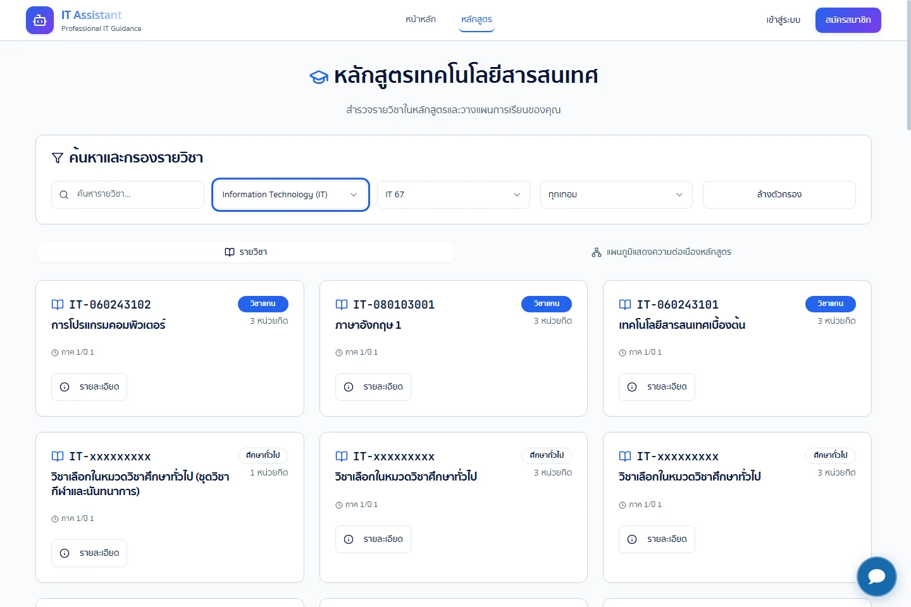
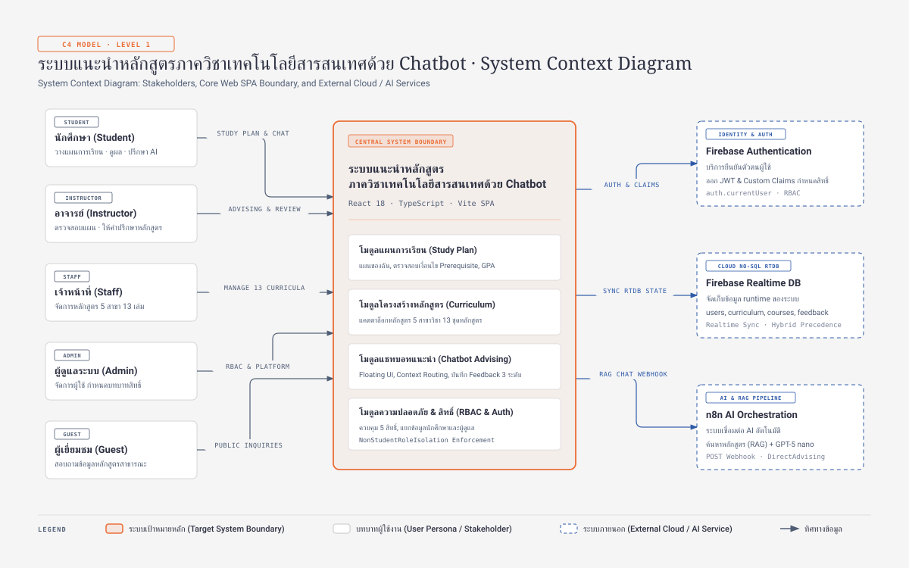
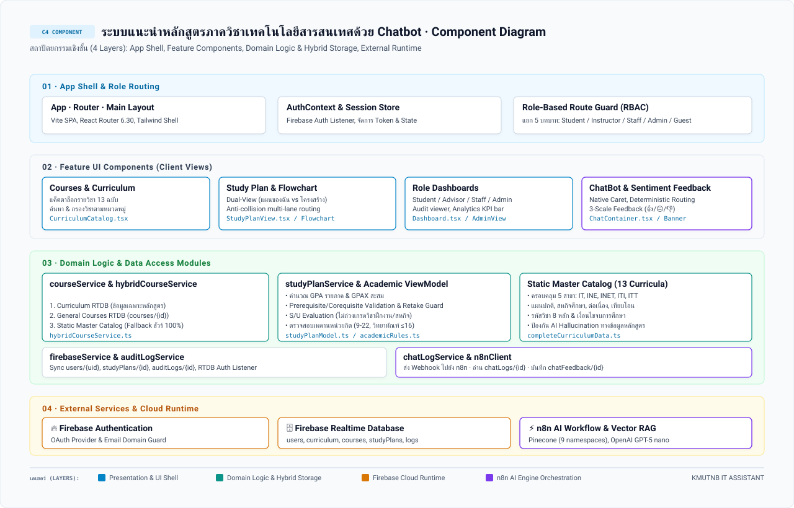
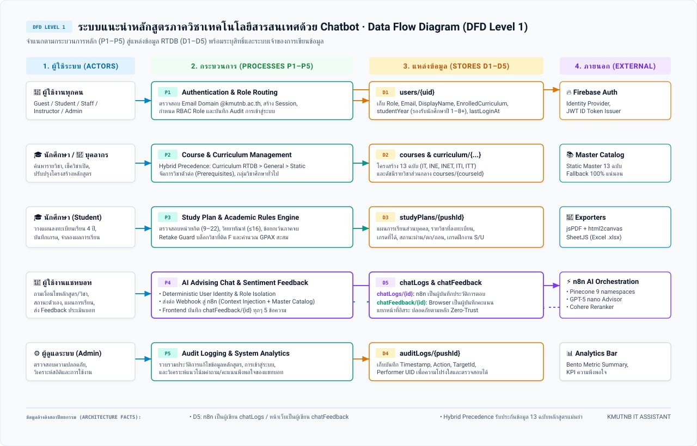
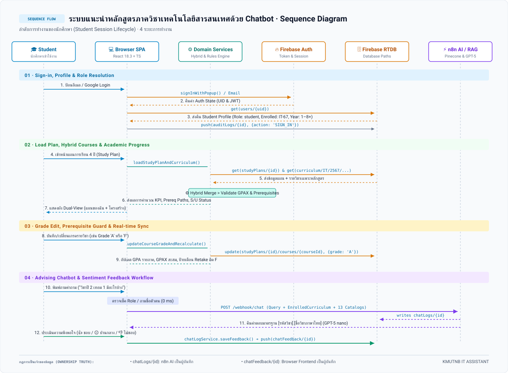

<div align="center">

# 🎓 IT Assistant
### ผู้ช่วยวางแผนการเรียนและสืบค้นข้อมูลหลักสูตรอัจฉริยะ
**ภาควิชาเทคโนโลยีสารสนเทศ · คณะเทคโนโลยีและการจัดการอุตสาหกรรม**  
**มหาวิทยาลัยเทคโนโลยีพระจอมเกล้าพระนครเหนือ (KMUTNB)**

<br />

[](https://react.dev)
[](https://www.typescriptlang.org)
[](https://vitejs.dev)
[](https://tailwindcss.com)
[](https://firebase.google.com)
[](https://n8n.io)
[](docs/audits/firebase-crud-credit-audit.md)

<br />

| 🏛️ **5 สาขาวิชาที่รองรับ** | 📚 **13 ชุดกฎหลักสูตร** | 🎯 **9 Pinecone Retrieval Namespaces** |
| :---: | :---: | :---: |
| **IT • INE • INET • ITI • ITT**<br />ครอบคลุมทั้งภาควิชาไอที มจพ. | **4 ปี • สหกิจ • ต่อเนื่อง • เทียบโอน**<br />ข้อมูลอ้างอิง `CurriculumMasterCatalog` | **Metadata Guard + RAG**<br />Pinecone Vector + GPT-5 nano |

<br />

[`📖 ภาพรวม`](#ภาพรวมระบบ) • [`🏗️ สถาปัตยกรรม`](#สถาปัตยกรรมระบบ) • [`🗺️ ขอบเขตหลักสูตร`](#ขอบเขตหลักสูตรที่รองรับ) • [`✨ ฟีเจอร์เด่น`](#ฟีเจอร์เด่น-bento-grid) • [`👥 บทบาทผู้ใช้`](#บทบาทและสิทธิ์ผู้ใช้งาน) • [`⚡ การติดตั้ง`](#การติดตั้งและเริ่มใช้งาน) • [`📜 วิศวกรรม & ADR`](#มาตรฐานวิศวกรรมและการตัดสินใจ-adr) • [`🛡️ ความปลอดภัย`](#ความปลอดภัยและการปกป้องข้อมูล)

</div>

---

## ภาพรวมระบบ

**IT Assistant** เป็นเว็บแพลตฟอร์มสำหรับบริหารจัดการการศึกษา วางแผนการเรียน 4 ปี และตรวจสอบเงื่อนไขหลักสูตรแบบเรียลไทม์ ออกแบบเฉพาะสำหรับนักศึกษา อาจารย์ที่ปรึกษา และบุคลากร ภาควิชาเทคโนโลยีสารสนเทศ มจพ. ปราศจากปัญหาข้อความกำกวมด้วยการผสานเทคโนโลยี **AI Advising Assistant** ผ่าน n8n Workflow และ Pinecone Vector Database เพื่อให้คำปรึกษาหลักสูตรที่ถูกต้อง แม่นยำ และสอดคล้องกับระเบียบมหาวิทยาลัย 100%

ตัวระบบถูกสร้างขึ้นบนรากฐานภาษาโมเดลโดเมน [CONTEXT.md](CONTEXT.md) ตามมาตรฐานวิศวกรรมซอฟต์แวร์ ควบคุมการทำงานด้วยระเบียบหน่วยกิตและภาวะวิทยาทัณฑ์ (Academic Standing Rules) พร้อมอินเทอร์เฟซระดับพรีเมียมโทนสีกรมท่า น้ำเงิน และขาว (KMUTNB Institutional Palette) ใช้งานได้อย่างลื่นไหลบนทุกขนาดหน้าจอ

<div align="center">



*ตัวอย่างหน้าจอสำรวจและค้นหารายวิชาในหลักสูตร (Curriculum Catalog) แสดงผลข้อมูลจริงพร้อมฟอนต์ภาษาไทยคมชัด*

</div>

---

## สถาปัตยกรรมระบบปัจจุบัน

ระบบเป็น React + TypeScript browser SPA ใช้ Firebase Authentication สำหรับ sign-in และ Firebase Realtime Database สำหรับข้อมูล runtime ส่วนการให้คำปรึกษา AI เรียก n8n ผ่าน webhook เพื่อทำ RAG และคืนคำตอบ

แผนภาพสถาปัตยกรรมด้านล่างถูกออกแบบในรูปแบบเวกเตอร์ความละเอียดสูง รองรับการสลับโหมด **GitHub Light &amp; Dark Mode** อัตโนมัติตามธีมของผู้ใช้ พร้อมลิงก์เปิดดูแบบ Interactive:

| ไดอะแกรม (Diagram) | มุมมองสถาปัตยกรรม | ภาพเวกเตอร์ (SVG) | ภาพความละเอียดสูง (PNG) | พรีวิวสลับธีม (HTML) |
| --- | --- | --- | --- | --- |
| **System Context Diagram** | บริบทระบบภาพรวมและผู้ใช้งาน 5 บทบาท | [Light](diagrams/diagrams3/system-context-diagram-light.svg) · [Dark](diagrams/diagrams3/system-context-diagram-dark.svg) | [Light](diagrams/diagrams3/system-context-diagram-light.png) · [Dark](diagrams/diagrams3/system-context-diagram-dark.png) | [system-context-diagram.html](diagrams/diagrams3/system-context-diagram.html) |
| **Component Diagram** | สถาปัตยกรรมเชิงชั้น 4 เลเยอร์ | [Light](diagrams/diagrams3/component-diagram-light.svg) · [Dark](diagrams/diagrams3/component-diagram-dark.svg) | [Light](diagrams/diagrams3/component-diagram-light.png) · [Dark](diagrams/diagrams3/component-diagram-dark.png) | [component-diagram.html](diagrams/diagrams3/component-diagram.html) |
| **Data Flow Diagram** | การไหลของข้อมูลระดับ 1 (DFD Level 1) | [Light](diagrams/diagrams3/data-flow-diagram-light.svg) · [Dark](diagrams/diagrams3/data-flow-diagram-dark.svg) | [Light](diagrams/diagrams3/data-flow-diagram-light.png) · [Dark](diagrams/diagrams3/data-flow-diagram-dark.png) | [data-flow-diagram.html](diagrams/diagrams3/data-flow-diagram.html) |
| **Sequence Diagram** | ลำดับการทำงานของนักศึกษา (Session Lifecycle) | [Light](diagrams/diagrams3/sequence-diagram-light.svg) · [Dark](diagrams/diagrams3/sequence-diagram-dark.svg) | [Light](diagrams/diagrams3/sequence-diagram-light.png) · [Dark](diagrams/diagrams3/sequence-diagram-dark.png) | [sequence-diagram.html](diagrams/diagrams3/sequence-diagram.html) |

<br />

### 1. บริบทระบบ · System Context Diagram

<picture>
  <source media="(prefers-color-scheme: dark)" srcset="diagrams/diagrams3/system-context-diagram-dark.svg">
  <source media="(prefers-color-scheme: light)" srcset="diagrams/diagrams3/system-context-diagram-light.svg">
  
</picture>

<br />

### 2. ส่วนประกอบเชิงชั้น · Component Diagram

<picture>
  <source media="(prefers-color-scheme: dark)" srcset="diagrams/diagrams3/component-diagram-dark.svg">
  <source media="(prefers-color-scheme: light)" srcset="diagrams/diagrams3/component-diagram-light.svg">
  
</picture>

<br />

### 3. การไหลของข้อมูล · Data Flow Diagram (DFD Level 1)

<picture>
  <source media="(prefers-color-scheme: dark)" srcset="diagrams/diagrams3/data-flow-diagram-dark.svg">
  <source media="(prefers-color-scheme: light)" srcset="diagrams/diagrams3/data-flow-diagram-light.svg">
  
</picture>

<br />

### 4. ลำดับการทำงาน · Sequence Diagram

<picture>
  <source media="(prefers-color-scheme: dark)" srcset="diagrams/diagrams3/sequence-diagram-dark.svg">
  <source media="(prefers-color-scheme: light)" srcset="diagrams/diagrams3/sequence-diagram-light.svg">
  
</picture>


### ข้อเท็จจริงที่ใช้ร่วมกันในแผนภาพ

- แหล่งข้อมูลรายวิชาแบบ Hybrid ให้ข้อมูล RTDB ของหลักสูตรเฉพาะมาก่อน `courses/{id}` ทั่วไป และใช้ Static master catalog เป็น fallback; เพิ่มวิชาใหม่ในมุมมองหลักสูตรจากข้อมูลเฉพาะหลักสูตร
- มี rule-catalog 13 รูปแบบหลักสูตร ขณะที่ Pinecone ใช้ 9 retrieval namespaces — เป็นคนละชุดข้อมูลและคนละหน้าที่
- Workflow ใน n8n เป็นผู้เขียน `chatLogs/{pushId}`; หน้าเว็บเขียน `chatFeedback/{pushId}` ผ่าน `chatLogService.saveFeedback()`
- `database.rules.json` ที่เช็กอินใน repository ยังไม่ประกาศ path `chatFeedback`; จึงไม่ถือเป็นหลักฐานว่ากฎที่ deploy อนุญาตการเขียน
- RTDB paths ที่แสดงประกอบด้วย `users/{uid}`, `courses/{id}`, `curriculum/{program}/{curriculumYear}/{year}/{semester}/courses/{id}`, `studyPlans/{pushId}`, `auditLogs/{pushId}`, `chatLogs/{pushId}` และ `chatFeedback/{pushId}`

## ขอบเขตหลักสูตรที่รองรับ

ระบบบรรจุฐานข้อมูล **CurriculumMasterCatalog** ครบถ้วนทั้ง 5 สาขาวิชา รวม 13 ฉบับหลักสูตรของภาควิชาเทคโนโลยีสารสนเทศ ขจัดปัญหาการตอบผิดพลาดของ AI (Hallucination) ด้วยการอ้างอิงโครงสร้างหลักสูตรและจำนวนหน่วยกิตที่รับรองอย่างเป็นทางการ:

| สาขาวิชา (Program) | รหัส | ฉบับหลักสูตรที่รองรับ (Curricula) | ระยะเวลาศึกษา | หน่วยกิตรวม |
| :--- | :---: | :--- | :---: | :---: |
| **เทคโนโลยีสารสนเทศ**<br />_Information Technology_ | `IT` | • หลักสูตร พ.ศ. 2562 (`IT-62`)<br />• หลักสูตร พ.ศ. 2562 สหกิจศึกษา (`IT-62-COOP`)<br />• หลักสูตร พ.ศ. 2567 (`IT-67`)<br />• หลักสูตร พ.ศ. 2567 สหกิจศึกษา (`IT-67-COOP`) | 4 ปี | 120 – 127 |
| **วิศวกรรมสารสนเทศและเครือข่าย**<br />_Information and Network Engineering_ | `INE` | • หลักสูตร พ.ศ. 2562 (`INE-62`)<br />• หลักสูตร พ.ศ. 2562 สหกิจศึกษา (`INE-62-COOP`)<br />• หลักสูตร พ.ศ. 2567 (`INE-67`)<br />• หลักสูตร พ.ศ. 2567 สหกิจศึกษา (`INE-67-COOP`) | 4 ปี | 125 – 135 |
| **เทคโนโลยีสารสนเทศและเครือข่าย**<br />_Information and Network Engineering_ | `INET` | • หลักสูตร พ.ศ. 2562 (`INET-62`)<br />• หลักสูตร พ.ศ. 2567 (`INET-67`) | 3 ปี | 102 – 103 |
| **เทคโนโลยีสารสนเทศ (ต่อเนื่อง)**<br />_Information Technology (Continuing)_ | `ITI` | • หลักสูตร พ.ศ. 2561 (`ITI-61`)<br />• หลักสูตร พ.ศ. 2566 (`ITI-66`) | 2 ปี | 78 – 81 |
| **เทคโนโลยีสารสนเทศ (เทียบโอน)**<br />_Information Technology (Transfer)_ | `ITT` | • หลักสูตร พ.ศ. 2567 (`ITT-67`) | 2 ปี | 84 |

---

## ฟีเจอร์เด่น (Bento Grid)

ระบบถูกออกแบบโดยแยกฟังก์ชันการทำงานหลักออกเป็น 4 ขุมพลังสำคัญ เพื่อประสบการณ์การใช้งานที่ราบรื่น:

### 🧭 1. จัดทำแผนการเรียนและผังวิชาอัจฉริยะ (Curriculum & Study Plan Engine)
> `Interactive Flowchart` · `Dual-View Progress` · `Anti-Collision Multi-Lane Routing` · `Prerequisites Path Tracing` · `GPAX Calculator` · `S/U Internship Evaluation` · `Academic Alert Dialogs` · `All-Curricula Progress KPI`

- **Visual Course Flowchart**: แสดงผังรายวิชาพร้อมเส้นเชื่อมโยงวิชาบังคับก่อน (Prerequisites) และวิชาบังคับร่วม (Corequisites) ด้วยสีสันที่แยกแยะสถานะชัดเจน
- **แผนการเรียน 4 ปี (Study Plan)**: จัดการรายวิชาตามชั้นปีและภาคการศึกษา พร้อมระบบจำลองเกรดเพื่อคำนวณ GPA รายภาคและ GPAX สะสม
- **มุมมองความคืบหน้าสองรูปแบบ (Dual-View Student Progress & Personal Timeline)**: รองรับการสลับมุมมองระหว่าง "แผนของฉัน (Personal Plan Timeline)" ที่ประมวลผลตำแหน่ง ชื่อ รหัส เกรด และหน่วยกิตจากข้อมูลที่นักศึกษาบันทึกไว้จริงตามรายภาคเรียนโดยตรง ร่วมกับ "โครงสร้างหลักสูตร (Curriculum Flowchart)" พร้อมระบบคำนวณ KPI และความคืบหน้าหน่วยกิตที่แม่นยำตรงตามรายงานผลการเรียน
- **แดชบอร์ดสรุปความคืบหน้ารายวิชาและหน่วยกิต (All 13 Curricula Progress KPI Dashboard)**: สรุปจำนวนวิชาและหน่วยกิตที่ผ่านเทียบกับเกณฑ์รวมของหลักสูตรอย่างละเอียด (เช่น `INE 62: 47/50 วิชา · 126/135 หน่วยกิต`) พร้อมป้ายสถานะระบุวิชาและหน่วยกิตที่ขาดอย่างชัดเจน (เช่น `ขาดอีก 3 วิชา · 9 หน่วยกิต` หรือ `ครบตามเกณฑ์หลักสูตรแล้ว`) รองรับครบทุก 13 ฉบับหลักสูตร และอัปเดตแบบเรียลไทม์เมื่อสลับแทร็กแผนการเรียน
- **ระบบสลับผังหลักสูตรและแทร็กสหกิจศึกษาอัตโนมัติ (Curriculum Track Switcher & Coop Auto-Selection)**: ปรับผังโครงสร้างหลักสูตรให้เป็นมาตรฐานทางการ พร้อมตรวจจับแทร็กของนักศึกษาเพื่อแสดงผลผังหลักสูตรแบบสหกิจศึกษา (Co-op) เป็นค่าเริ่มต้นโดยอัตโนมัติ และเปิดให้สลับมุมมองระหว่างแผนปกติและแผนสหกิจได้อย่างอิสระ
- **ระบบแจ้งเตือนและกล่องยืนยันธีมวิชาการ (Academic Alert & Confirmation Modal Dialogs)**: ยกระดับการแจ้งเตือนจาก Native Browser Dialog (`alert()`, `window.confirm()`) สู่ `AcademicAlertDialog` บน Radix UI Primitives สอดคล้องกับ Academic Design System ป้องกันความผิดพลาดในการลงทะเบียน เช่น วิชาบังคับก่อนไม่ผ่าน (ติด F/U), การย้ายภาคเรียนที่ขัดแย้งกับ Prerequisite, ข้อกำหนดเกรดฝึกงาน S/U และกล่องยืนยันการรีเซ็ตแผนการเรียนพร้อมปุ่มยืนยันสีแดงพรีเมียม
- **ระบบผังเส้นทางวิชาต่อเนื่องแบบลดการทับซ้อน (Anti-Collision Multi-Lane Flowchart Routing & Smooth Rounded Corners)**:
  - **Multi-Lane Track Allocator**: จัดสรรเลนย่อย (Offset $\pm 5\text{px}$ ถึง $\pm 6\text{px}$) สำหรับเส้นที่วิ่งขนานกันในร่องเดียวกันทั้งแนวนอนและแนวตั้ง ป้องกันเส้นทับซ้อนกันเป็นเส้นเดียวในหลักสูตรที่มีความซับซ้อนสูง (เช่น INE 62, INE 67, IT 62, INET 62)
  - **Multi-Port Spreading**: สำหรับวิชาที่มีวิชาตัวต่อหลายตัว (เช่น `060233108` มีวิชาต่อ 5 ตัว) จุดส่งออกของลูกศรบนขอบขวาของการ์ดจะกระจายตัวในแนวตั้งตามจำนวนเส้น ไม่กระจุกตัวที่จุดกึ่งกลาง
  - **Bottom Bus Channel (ทางด่วนข้ามเทอมระยะไกล $\ge 3$ เทอม)**: เส้นทางที่ข้ามภาคเรียนไกลๆ จะถูกนำทางอ้อมผ่านช่องทางรอบนอกด้านล่างตาราง ทำให้ไม่วิ่งผ่าตัดผ่านกลางแถววิชาของเทอมตรงกลาง ตารางวิชาจึงสะอาดและอ่านง่าย
  - **Smooth Rounded Corners**: แปลงมุมเลี้ยวหักฉาก 90 องศาเป็นมุมโค้งมน (Quadratic Bezier Fillet Arc Radius 7px) ช่วยให้อ่านและติดตามสายวิชาได้อย่างลื่นไหล
  - **Interactive Tracing & Focus Mode**: เลื่อนเมาส์ชี้ที่เส้น (Hover Tooltip) เพื่อดูคู่ความต่อเนื่อง คลิกเลือกวิชาเพื่อไฮไลต์สายวิชาบังคับก่อน (สีน้ำเงิน) และวิชาเรียนต่อได้ (สีม่วง) พร้อมปุ่มเปิด/ปิด "โหมดโฟกัส" (Focus Mode)
  - **Master Catalog Fallback**: รองรับและผ่านการตรวจสอบความถูกต้อง 100% ครอบคลุมครบทั้ง 13 ฉบับหลักสูตร
- **ระบบคงความถูกต้องของข้อมูลรายวิชา (Identity & Origin Preservation)**: ป้องกันการเขียนทับรหัสวิชาตั้งต้นด้วย `customCode` และป้องกันข้อมูลสูญหายเมื่อมีการแก้ไขชื่อหรือย้ายภาคเรียน ผ่าน `serializeStudentCourse`
- **ระบบประเมินผลฝึกงาน/สหกิจศึกษา (S/U Evaluation System)**: รองรับการประเมินผลรายวิชาฝึกงานและสหกิจศึกษาด้วยเกรด `S` (Satisfactory - ผ่าน) และ `U` (Unsatisfactory - ไม่ผ่าน) โดยไม่นำมาถ่วงน้ำหนักแต้มระดับคะแนน (Non-graded credits) ตามข้อบังคับมหาวิทยาลัย
- **ระบบค้นหาความเร็วสูง**: กรองวิชาตามกลุ่มวิชาศึกษาทั่วไป วิชาเฉพาะ และวิชาเลือกเสรี พร้อมค้นหาได้ทั้งรหัสวิชาและชื่อภาษาไทย/อังกฤษ

### ⚖️ 2. ควบคุมกฎระเบียบวิชาการอัตโนมัติ (Academic Rules & Validation Engine)
> `Credit Limits Enforcement` · `Probation Guard` · `Graduation Exemption`

- **ขอบเขตหน่วยกิตภาคปกติ**: ควบคุมการลงทะเบียนให้อยู่ระหว่าง 9 ถึง 22 หน่วยกิต ตามข้อบังคับมหาวิทยาลัย
- **ระบบเฝ้าระวังภาวะวิทยาทัณฑ์ (Probation Rule)**: นักศึกษาที่มีสถานะวิทยาทัณฑ์จะถูกจำกัดการลงทะเบียนสูงสุดไม่เกิน 16 หน่วยกิต (ต้องผ่านคำร้อง Probation Petition หากมีเหตุจำเป็น)
- **ภาคฤดูร้อนและภาคจบการศึกษา**: จำกัดการลงทะเบียนภาคฤดูร้อนไม่เกิน 6 หน่วยกิต และเปิดระบบยกเว้น (Graduation Term Exemption) ให้ลงต่ำกว่า 9 หน่วยกิตได้ในภาคเรียนสุดท้าย

### 🤖 3. แชทบอทให้คำปรึกษาหลักสูตร (Modern Academic Chat Surface)
> `n8n Orchestration (v14)` · `Pinecone Vector RAG` · `Deterministic Identity & Status Routing` · `Non-Student Role Isolation` · `Curriculum Duration Guard` · `Sentiment Feedback` · `Native Caret Navigation`

- **การนำทางเคอร์เซอร์ด้วยปุ่มลูกศร (Native Caret & Arrow Key Navigation)**: แก้ไขปัญหาช่องพิมพ์ของ `@n8n/chat` ดักจับคีย์บอร์ดที่ Container แม่แล้วเรียก `preventDefault()` อัตโนมัติ โดยทำการตัดการกระจายอีเวนต์ (Stop Propagation) ในระดับ Textarea ทำให้ผู้ใช้สามารถใช้งานปุ่มลูกศร (`ArrowLeft`, `ArrowRight`, `ArrowUp`, `ArrowDown`), `Home`, `End`, `PageUp`, `PageDown`, การเลื่อนเคอร์เซอร์ข้ามบรรทัด และการคลุมเลือกข้อความ (`Shift + Arrow` / `Ctrl + Arrow`) ในช่องพิมพ์ได้อย่างสมบูรณ์ 100%
- **ระบบชี้ขาดตัวตนผู้ใช้และการแยกสิทธิ์ Non-Student อัตโนมัติ (Deterministic User Identity & Role Isolation)**: แยกแยะระหว่างนักศึกษาและบุคลากร (`admin`, `instructor`, `staff`) อย่างเด็ดขาด ดักจับคำถามเกี่ยวกับชื่อ ตัวตน หรือหลักสูตรที่ศึกษา (เช่น *"ผมชื่ออะไรตอนนี้ผมเรียนหลักสูตรอะไร"*, *"ผมเรียนสาขาอะไร"*, *"ฉันเป็นใคร"*) แล้วตอบกลับทันทีแบบ Deterministic (Bypass LLM 0 ms) โดยสำหรับบัญชีที่ไม่ใช่นักศึกษา ระบบจะระบุบทบาทอย่างถูกต้อง (เช่น ผู้ดูแลระบบ / อาจารย์ผู้สอน / เจ้าหน้าที่) และระบุว่าไม่มีข้อมูลหลักสูตรที่กำลังศึกษาในระบบ ป้องกัน AI นำหลักสูตร IT-67 ไปผูกกับ Admin หรือถามขอรหัสนักศึกษาโดยเด็ดขาด
- **รองรับสถานะนักศึกษาปี 5+ ครบทุกหลักสูตร**: ผสานระบบคำนวณสถานะความคืบหน้าของนักศึกษาที่เรียนเกินระยะเวลามาตรฐานของหลักสูตร (เช่น นักศึกษาปี 5 ภาคปกติที่เหลือเก็บวิชาโปรเจกต์) โดยรายงานทั้งจำนวนวิชาที่ผ่าน หน่วยกิตสะสม วิชาที่กำลังศึกษา ชั้นปีจริง และหน่วยกิตคงเหลือสู่การสำเร็จการศึกษาตามระเบียบมหาวิทยาลัย พร้อมระบบป้องกัน Role Truth Lock ใน AI Agent
- **ระบบคำนวณชั้นปีและสถานะขยายเวลาเรียน (Universal Student Year Engine)**: คำนวณและระบุชั้นปีและภาคการศึกษาจริงของนักศึกษาจากวิชาที่กำลังศึกษา (`in_progress`) หรือประวัติวิชาสอบผ่าน รองรับตั้งแต่ชั้นปีที่ 1 ถึงปี 8+ พร้อมตรวจจับสภาวะนักศึกษาเกินระยะเวลาเรียนมาตรฐานของหลักสูตร (`isExtendedYears` เช่น ปี 5 สำหรับหลักสูตร 4 ปี, ปี 3 สำหรับหลักสูตรเทียบโอน 2 ปี, ปี 4 สำหรับหลักสูตร 3 ปี)
- **ระบบดักจับคำถามสถานะและประวัติการเรียนแบบ Deterministic (Personal Study Status Router)**: ตรวจจับคำถามสอบถามประวัติการเรียน สถานะชั้นปี รายวิชาที่ผ่าน และรายวิชาที่กำลังเรียน (เช่น *"ผมเรียนผ่านแล้วกี่วิชา กำลังเรียนกี่วิชา และกำลังเรียนปีอะไร"*, *"ตอนนี้ผมอยู่ปีไหน"*) แล้วคืนสรุปประวัติวิชาผ่าน วิชาที่กำลังเรียน ชั้นปีปัจจุบัน และความคืบหน้าหน่วยกิตจาก Realtime Database โดยตรงด้วยความแม่นยำ 100%
- **ระบบบันทึกและซิงก์โปรไฟล์ชั้นปีอัตโนมัติ (Automated Firebase RTDB Student Year Sync)**: บันทึกรายวิชาในชั้นปีที่ 1 ถึง 8+ ลง `studyPlans/{planId}/courses` พร้อมคำนวณและอัปเดตชั้นปีจริง (`studentYear` / `year`) ลงในโปรไฟล์ผู้ใช้ `users/{userId}` และ `studyPlans/{planId}` ใน Firebase Realtime Database โดยอัตโนมัติเมื่อนักศึกษาจัดตารางเรียนหรือเข้าใช้งาน Dashboard
- **ระเบียบการตั้งค่าเริ่มต้นสำหรับผู้ใช้ใหม่ (New User Student Onboarding)**: เมื่อผู้ใช้สมัครสมาชิกใหม่ ระบบจะกำหนดสิทธิ์เริ่มต้นเป็นนักศึกษา (`student`) โดยไม่มีการเลือกสาขาวิชาล่วงหน้าจนกว่านักศึกษาจะเลือกที่หน้าโปรไฟล์หรือเริ่มจัดทำแผนการเรียน ป้องกันการระบุสาขาวิชาไม่ตรงกับความเป็นจริง
- **ฐานข้อมูลหลักสูตรแม่บท 13 ฉบับ (Authoritative 13 Curricula Master Catalog & Whitelist)**: รวบรวมข้อมูลหลักสูตรครบถ้วนทั้ง 13 ฉบับใน [MASTER_CURRICULUM_CATALOG.md](MASTER_CURRICULUM_CATALOG.md) และ [N8N_PREREQUISITES_GUIDE.md](N8N_PREREQUISITES_GUIDE.md) พร้อมรหัสวิชา 8 หลัก และชื่อวิชาภาษาไทยทางการ ควบคุมเงื่อนไขสหกิจศึกษาและฝึกงานภาคฤดูร้อนตามข้อเท็จจริง ป้องกัน AI แนะนำวิชาหรือเทอมที่ไม่มีอยู่จริง (เช่น ป้องกันการแนะนำ Co-op หรือ ซัมเมอร์ ใน ITT-67)
- **การคงบริบทหลักสูตรต่อเนื่อง (Multi-Turn Curriculum Persistence)**: ระบบจดจำหลักสูตรที่กำลังสนทนา (`ActiveConversationCurriculum`) ข้ามเทิร์นคำถาม แม้ผู้ใช้จะไม่ได้พิมพ์ชื่อหลักสูตรซ้ำในข้อความถัดไป
- **ระบบควบคุมระยะเวลาศึกษา (CurriculumDurationGuard)**: ป้องกันความผิดพลาดของ AI ในการสร้างข้อมูลปี 3 และปี 4 สำหรับหลักสูตรต่อเนื่อง/เทียบโอน 2 ปี (เช่น `ITT-67` มี 28 วิชา 84 หน่วยกิต เรียนเฉพาะปี 1 และปี 2)
- **กฎการแนะนำลงทะเบียนกรณีติด F (RetakePrerequisiteBlock & PassedCourseExclusion)**: คัดแยกวิชาที่สอบผ่านแล้วออกจากแผนลงทะเบียนใหม่อัตโนมัติ พร้อมตรวจจับและบล็อกการลงวิชาต่อเนื่องที่ยังติดวิชาบังคับก่อน (Prerequisite) จนกว่าจะลงทะเบียนเรียนซ้ำวิชาที่ติด F
- **นโยบายให้คำแนะนำทันที (Direct Advising Response Policy)**: บังคับให้บอทแสดงข้อมูล ตารางรายวิชา และคำแนะนำการลงทะเบียนที่สมบูรณ์ทันทีโดยไม่ถามย้อนเพื่อขออนุญาตแสดงผล
- **การป้อนบริบทอัตโนมัติ (Context Injection)**: ส่งรหัสหลักสูตรที่นักศึกษาศึกษาอยู่ (`EnrolledCurriculum`) และแคตตาล็อกรวม 13 ฉบับ เข้าสู่ Prompt แชทบอท เพื่อให้ได้คำตอบที่ถูกต้องตรงกับโครงสร้างจริง 100%
- **มาตรฐานชื่อวิชา (CoursePresentationFormat)**: คำตอบจากบอทจะประกอบด้วย `[รหัสวิชา] [ชื่อวิชาภาษาไทย]` เสมอ ไม่ปล่อยรหัสวิชาลอยๆ ให้นักศึกษาสับสน
- **ระบบสำรวจความพึงพอใจ 3 ระดับ (FeedbackScale)**: แสดงป้ายประเมินความพึงพอใจ (👎 ไม่ชอบ, 😐 ปานกลาง, 👍 ชอบ) ทุกๆ 5 ข้อความ พร้อมบันทึกสถิติเข้าสู่ Realtime Database
- **แถบเวลาการแจ้งเตือน (Alert Timeout Progress)**: Toast, inline error และข้อความขอบคุณหลังส่ง feedback ที่ปิดอัตโนมัติจะแสดงแถบบางที่ขอบล่างเพื่อบอกเวลาคงเหลือ โดยแถบและการปิดใช้ตัวจับเวลาเดียวกัน

### 📑 4. รายงานและการบริหารจัดการระดับองค์กร (Reporting & Admin Controls)
> `PDF/Excel Exporters` · `Dual-Layer Persistence` · `Analytics Dashboard`

- **ส่งออกเอกสารคุณภาพสูง**: พิมพ์หรือดาวน์โหลดแผนการเรียนและใบสรุปหน่วยกิตเป็นไฟล์ PDF (jsPDF + html2canvas) และตาราง Excel (SheetJS)
- **สถาปัตยกรรมข้อมูล 2 ชั้น**: จัดเก็บแยกส่วนระหว่าง `curriculum/` (โครงสร้างตามแผน) และ `courses/` (ดัชนีสืบค้นข้ามสาย) เพื่อป้องกันข้อมูลสูญหาย
- **แดชบอร์ดสถิติแชทบอท (Chat Analytics)**: ผู้ดูแลระบบสามารถตรวจสอบคำถามยอดนิยม อัตราความพึงพอใจ และความถี่ในการใช้งานระบบได้แบบเรียลไทม์

---

## บทบาทและสิทธิ์ผู้ใช้งาน

| บทบาท (Role) | สิทธิ์และการใช้งานหลัก |
| :--- | :--- |
| **🎓 นักศึกษา (Student)** | • วางแผนการเรียน บันทึกผลการเรียน และตรวจสอบสถานะหน่วยกิตของตนเอง<br />• ใช้งานแชทบอทเพื่อสอบถามข้อมูลหลักสูตรและการลงทะเบียน โดยระบบจะวิเคราะห์ประวัติและสถานะชั้นปีจริง (รองรับปี 1 ถึงปี 8+)<br />• ส่งออกเอกสารแผนการเรียนในรูปแบบ PDF และ Excel<br />*(หมายเหตุ: ผู้สมัครสมาชิกใหม่จะได้รับบทบาทเป็นนักศึกษา และต้องเลือกสาขาวิชาด้วยตนเองในหน้าโปรไฟล์หรือแผนการเรียน)* |
| **👨‍🏫 อาจารย์ที่ปรึกษา (Instructor)** | • เรียกดูรายชื่อและค้นหาข้อมูลนักศึกษาในความดูแล<br />• ตรวจสอบแผนการเรียนและประวัติการลงทะเบียนของนักศึกษาเพื่อให้คำปรึกษา<br />• ใช้งานแชทบอทในฐานะอาจารย์ผู้สอน (ระบบจะไม่ผูกหลักสูตรนักศึกษาหรือประวัติการเรียน) |
| **🏢 เจ้าหน้าที่ภาควิชา (Staff)** | • จัดการฐานข้อมูลรายวิชา เงื่อนไขวิชา และหลักสูตรในระบบ<br />• ตรวจสอบภาพรวมข้อมูลหลักสูตรและการลงทะเบียน<br />• ใช้งานแชทบอทในฐานะเจ้าหน้าที่ภาควิชา (ไม่มีหลักสูตรนักศึกษาผูกมัด) |
| **⚙️ ผู้ดูแลระบบ (Admin)** | • จัดการบัญชีผู้ใช้งานและกำหนดสิทธิ์ (Role Assignment)<br />• ตรวจสอบภาพรวมระบบและวิเคราะห์ผลตอบรับของแชทบอท (Chat Analytics)<br />• ใช้งานแชทบอทในฐานะผู้ดูแลระบบสูงสุด ปราศจากการผูกหลักสูตรเรียนของนักศึกษา |

---

## เทคโนโลยีและเครื่องมือ

- **Frontend Core:** React 18.3, TypeScript 5.8 (Strict Mode & TS 7.0 Ready: Modern Bundler Resolution), Vite 5.4
- **UI & Styling:** Tailwind CSS 3.4, shadcn/ui, Radix UI Primitives, Lucide Icons
- **State & Data Synchronization:** TanStack React Query 5.83, React Router 6.30
- **Database & Authentication:** Firebase Authentication, Firebase Realtime Database
- **AI & Automation Workflow:** n8n Workflow Orchestration, Pinecone Vector Database, OpenAI GPT-5 nano
- **Document & Export Services:** jsPDF 3.0, html2canvas 1.4, SheetJS (xlsx) 0.18
- **Data Validation & Forms:** Zod 3.25, React Hook Form 7.61

---

## การติดตั้งและเริ่มใช้งาน

### 1. ความต้องการของระบบ (Prerequisites)

- **Node.js**: เวอร์ชัน 18.x หรือสูงกว่า
- **npm** หรือ **bun**: ตัวจัดการแพ็กเกจ
- **Firebase Project**: ที่เปิดใช้งาน Authentication (Email/Password) และ Realtime Database
- **n8n Instance / Webhook URL**: สำหรับรองรับการประมวลผลของแชทบอท

### 2. การติดตั้งโปรเจกต์ (Installation)

```bash
# โคลนคลังข้อมูล
git clone https://github.com/kainapatkmutnb/it-course-chatbot-main.git
cd it-course-chatbot-main

# ติดตั้งแพ็กเกจและ dependencies
npm ci
```

### 3. การตั้งค่าตัวแปรสภาพแวดล้อม (Environment Configuration)

สร้างไฟล์ `.env` จากตัวอย่าง `.env.example`:

```bash
# macOS / Linux
cp .env.example .env

# Windows PowerShell
Copy-Item .env.example .env
```

#### ตารางแจกแจงตัวแปรใน `.env`

| ตัวแปร | ความจำเป็น | คำอธิบาย |
| :--- | :---: | :--- |
| `VITE_FIREBASE_API_KEY` | **จำเป็น** | Firebase Web API Key |
| `VITE_FIREBASE_AUTH_DOMAIN` | **จำเป็น** | Firebase Authentication Domain (เช่น `<project>.firebaseapp.com`) |
| `VITE_FIREBASE_DATABASE_URL` | **จำเป็น** | Firebase Realtime Database URL (เช่น `https://<project>-default-rtdb.asia-southeast1.firebasedatabase.app/`) |
| `VITE_FIREBASE_PROJECT_ID` | **จำเป็น** | Firebase Project ID |
| `VITE_FIREBASE_STORAGE_BUCKET` | **จำเป็น** | Firebase Storage Bucket URL |
| `VITE_FIREBASE_MESSAGING_SENDER_ID`| **จำเป็น** | Firebase Cloud Messaging Sender ID |
| `VITE_FIREBASE_APP_ID` | **จำเป็น** | Firebase Web App ID |
| `VITE_N8N_WEBHOOK_URL` | **จำเป็น** | Production Webhook URL ของ n8n สำหรับรับ-ส่งข้อความแชทบอท |
| `VITE_N8N_SUMMARY_WEBHOOK_URL` | ทางเลือก | Webhook URL สำหรับ workflow สรุปข้อมูลการสนทนา |

> [!WARNING]
> ห้าม Commit ไฟล์ `.env` หรือส่งต่อ Private Key เข้าสู่ Git Repository โดยเด็ดขาด ตรวจสอบ URL ของฐานข้อมูลและ Project ID ให้ตรงกับ Environment ก่อนทำการบันทึกข้อมูลเสมอ

### 4. การรันระบบในเครื่อง (Local Development)

```bash
# เริ่มต้น Development Server
npm run dev
```

เปิดเว็บเบราว์เซอร์ที่ [http://localhost:8080](http://localhost:8080) (หรือตาม Port ที่ Vite ระบุใน Terminal)

### 5. การทดสอบด้วย Firebase Emulator

โปรเจกต์มีระบบจำลอง Firebase ในเครื่องเพื่อความปลอดภัยในการทดสอบ CRUD:

```bash
# Terminal 1: เริ่มต้น Firebase Local Emulator (Auth + Database)
npm run firebase:emulators

# Terminal 2: รันเว็บแอปใน Test Mode ที่เชื่อมกับ Emulator
npm run dev:emulator
```

> [!NOTE]
> การรันในโหมด Emulator ต้องใช้ `.env.test` ที่มี Project ID ในรูปแบบ `demo-*` (เช่น `demo-it-course-chatbot`) ระบบจะปฏิเสธการเชื่อมต่อไปยังฐานข้อมูลจริงเพื่อป้องกันข้อมูลเสียหาย

### 6. การนำเข้าข้อมูลหลักสูตร (Curriculum Data Migration)

หากต้องการตั้งค่าข้อมูลรายวิชาและโครงสร้างหลักสูตรเริ่มต้นเข้าสู่ Realtime Database:

```bash
npm run migrate:curriculum
```

### 7. การตรวจสอบโค้ดและการทดสอบ (Testing & Production Build)

ชุดทดสอบด้านล่างตรวจตรรกะในเครื่อง ผลผ่านไม่ได้ยืนยันผลตอบกลับจริงจาก n8n หรือการแสดงผลในเบราว์เซอร์ ซึ่งต้องตรวจแยกเมื่อแก้ส่วนที่เกี่ยวข้อง

```bash
# ตรวจข้อมูลความคืบหน้าและตัวตนรายวิชาของนักศึกษา
npx tsx --test tests/study-plan/progress.test.ts

# ตรวจเงื่อนไขระยะเวลาเรียน ฝึกงาน และสหกิจของ 13 หลักสูตร
npx tsx --test tests/curriculum/curriculumGuard.test.ts

# ตรวจสอบ Linting
npm run lint

# สร้าง Production Bundle
npm run build

# ทดสอบรัน Production Bundle ในเครื่อง
npm run preview
```

---

## โครงสร้างไดเรกทอรี

```text
it-course-chatbot-main/
├── diagrams/                # แผนภาพสถาปัตยกรรม (Context, DFD, Component, Sequence)
├── docs/
│   ├── adr/                 # Architecture Decision Records (ADR-001 ถึง ADR-010)
│   ├── audits/              # รายงานผลการตรวจสอบระบบ (CRUD Audit, Navigation QA)
│   └── superpowers/         # บันทึกแผนการพัฒนาและแบบร่างระบบ
├── public/                  # Static Assets และฟอนต์ภาษาไทย
├── src/
│   ├── components/          # UI Components
│   │   ├── chat/            # โมดูลแชทบอทและแบนเนอร์ Feedback
│   │   ├── curriculum/      # ผังหลักสูตรและ Flowchart รายวิชา
│   │   ├── dashboard/       # แดชบอร์ดตามสิทธิ์ (Admin, Staff, Instructor, Student)
│   │   ├── layout/          # โครงหน้าเว็บ Header, Footer และ Navigation
│   │   ├── study-plan/      # ตัวจัดการแผนการเรียน, ระบบคำนวณหน่วยกิต, และ Academic Alert Dialog
│   │   └── ui/              # shadcn / Radix UI Design System Primitives
│   ├── contexts/            # Context Providers (Auth, System State)
│   ├── hooks/               # Custom React Hooks
│   ├── pages/               # Routing Page Components
│   ├── services/            # บริการเชื่อมต่อ Firebase, n8n และหลักสูตร
│   ├── types/               # TypeScript Interfaces และ Type Definitions
│   └── utils/               # ฟังก์ชันคำนวณหน่วยกิตและโมดูล Export PDF/Excel
├── tests/
│   └── study-plan/          # ชุดทดสอบ Regression สำหรับ Study Plan View Model & Identity
├── CONTEXT.md               # Ubiquitous Language & Domain Model ของระบบ
├── database.rules.json      # กฎความปลอดภัย Firebase Realtime Database Rules
├── MASTER_CURRICULUM_CATALOG.md # คลังหลักสูตรฉบับสมบูรณ์ 13 ฉบับ (Single Source of Truth สำหรับ AI ChatBot)
├── N8N_PREREQUISITES_GUIDE.md # คู่มือการตั้งค่า n8n Webhook และ Vector Database
└── package.json             # โปรเจกต์สคริปต์และรายการ Dependencies
```

---

## มาตรฐานวิศวกรรมและการตัดสินใจ (ADR)

### เงื่อนไขหลักสูตรที่ส่งให้แชทบอท

[`CURRICULUM_RULES_CATALOG`](src/services/curriculumCatalogService.ts) เก็บเงื่อนไขแยกตามหลักสูตร 13 ฉบับ พร้อมข้อมูลสำรองระดับสาขา 5 กลุ่ม ได้แก่ ระยะเวลาเรียน ภาคการศึกษาที่รองรับ หน่วยกิต และรายละเอียดฝึกงาน/สหกิจ โดย [`ChatBot.tsx`](src/components/chat/ChatBot.tsx) ส่ง `curriculumDurationGuard` และข้อมูลหลักสูตรที่เลือกไปกับบริบทของคำถาม เพื่อกำหนดให้ใช้ metadata นี้เมื่อข้อมูลจาก RAG ขัดแย้งกัน

เงื่อนไขดังกล่าวเป็นข้อมูลอ้างอิงของหลักสูตร ส่วนตำแหน่งวิชาใน **แผนของฉัน** ใช้ปีและเทอมที่นักศึกษาบันทึกไว้ การย้ายวิชาของนักศึกษาจึงไม่ใช่การเปลี่ยนโครงสร้างหลักสูตรกลาง และสัดส่วนหน่วยกิตที่ผ่านไม่ใช่ผลรับรองว่าครบเงื่อนไขสำเร็จการศึกษา

ดูกรณีทดสอบใน [`curriculumGuard.test.ts`](tests/curriculum/curriculumGuard.test.ts) และรายละเอียดการส่งบริบทใน [คู่มือ prerequisite สำหรับ n8n](N8N_PREREQUISITES_GUIDE.md)

### บันทึกการตัดสินใจ

ระบบนี้พัฒนาโดยยึดหลักการออกแบบเชิงสถาปัตยกรรมและบันทึกการตัดสินใจที่สำคัญผ่าน **Architecture Decision Records (ADR)**:

| รหัสเอกสาร | หัวข้อการตัดสินใจ (Architectural Decision) | สถานะ |
| :---: | :--- | :---: |
| [ADR-001](docs/adr/ADR-001-custom-course-code-and-dynamic-years.md) | รองรับรหัสวิชาแบบกำหนดเองและปีหลักสูตรแบบไดนามิก | **Accepted** |
| [ADR-002](docs/adr/ADR-002-chat-feedback-system-and-admin-analytics.md) | ระบบสำรวจความพึงพอใจการสนทนาและแดชบอร์ดวิเคราะห์ผล | **Accepted** |
| [ADR-003](docs/adr/ADR-003-chatbot-toggle-ux-and-branding.md) | มาตรฐานปุ่มเปิด-ปิดแชทบอทและการนำเสนอแบรนด์ภาควิชา | **Accepted** |
| [ADR-004](docs/adr/ADR-004-toast-alert-redesign-and-positioning.md) | การออกแบบการแจ้งเตือน Toast แจ้งเตือนสถานะและตำแหน่งแสดงผล | **Accepted** |
| [ADR-005](docs/adr/ADR-005-registration-credit-limits-and-probation-rules.md) | ขอบเขตหน่วยกิตการลงทะเบียนและเกณฑ์การควบคุมภาวะวิทยาทัณฑ์ | **Accepted** |
| [ADR-006](docs/adr/ADR-006-multi-curriculum-context-resolution-and-catalog-injection.md) | กลไกชี้ขาดบริบทหลักสูตรและการป้อนข้อมูลแคตตาล็อกสู่ n8n | **Accepted** |
| [ADR-007](docs/adr/ADR-007-theme-adaptive-architectural-diagram-standards.md) | มาตรฐานไดอะแกรมสถาปัตยกรรมแบบปรับตามธีม (Dark/Light Mode) และการใช้ Native Mermaid | **Accepted** |
| [ADR-008](docs/adr/ADR-008-multi-turn-curriculum-persistence-and-advising-prerequisite-guard.md) | การคงบริบทหลักสูตรข้ามข้อความ (Multi-Turn Persistence) และระบบป้องกันเงื่อนไขการแนะนำลงทะเบียนวิชาติด F | **Accepted** |
| [ADR-009](docs/adr/ADR-009-page-grounded-concise-chat-answers.md) | คำตอบแชทบอทแบบกระชับและการอ้างอิงหลักฐานหน้าเอกสาร PDF (Page-Grounded Concise Chat Answers) | **Accepted** |
| [ADR-010](docs/adr/ADR-010-non-student-role-isolation-and-deterministic-identity-routing.md) | การแยกบทบาทผู้ใช้ที่ไม่ใช่นักศึกษาและระบบเราต์ตัวตนผู้ใช้แบบ Deterministic (Non-Student Role Isolation & Deterministic Identity Routing) | **Accepted** |

### รายงานการตรวจสอบคุณภาพและมาตรฐานการออกแบบ (Quality Assurance & Architecture Specs)

- [Student Progress Consistency Implementation Plan](docs/superpowers/plans/2026-09-13-student-progress-consistency.md) — แผนปฏิบัติการและผลการปรับปรุงความสอดคล้องของภาพรวมความคืบหน้านักศึกษา (Dual-View Progress, Pure ViewModel Projection, Identity Preservation)
- [Modern Academic Web Redesign QA Audit](docs/audits/modern-academic-web-redesign-qa.md) — รายงานการตรวจรับส่วนติดต่อผู้ใช้สไตล์วิชาการร่วมสมัย ครอบคลุม 13 มิติการทดสอบและผลการตรวจรับ Protected Files 100%
- [Modern Academic Web Redesign Specification](docs/superpowers/specs/2026-09-13-modern-academic-web-redesign.md) — ข้อกำหนดรายละเอียดการออกแบบระบบวิชาการร่วมสมัย (Opt-in Architecture, Color Tokens, Typography, Accessibility)
- [Modern Academic Web Redesign Implementation Plan](docs/superpowers/plans/2026-09-13-modern-academic-web-redesign.md) — แผนปฏิบัติการ 9 ระยะสำหรับการยกระดับ UI และการควบคุมความเสี่ยง
- [Alert Timeout Progress QA](docs/audits/alert-timeout-progress-qa.md) — รายงานการตรวจสอบแถบเวลาคงเหลือสำหรับ toast, inline error และ feedback confirmation ที่ปิดอัตโนมัติ
- [Firebase CRUD & Credit Validation Audit](docs/audits/firebase-crud-credit-audit.md) — ผลการตรวจสอบความถูกต้องของการบันทึกข้อมูลและคำนวณหน่วยกิต (อัตราผ่าน 100%, 8/8 การทดสอบ)
- [Responsive Navigation & Student Flow QA](docs/audits/mobile-navigation-student-qa.md) — ผลการทดสอบการใช้งานบนอุปกรณ์พกพาและการนำทางของผู้ใช้นักศึกษา

---

## ความปลอดภัยและการปกป้องข้อมูล

1. **การยืนยันตัวตนและการจำกัดสิทธิ์**: ตรวจสอบบัญชีผู้ใช้ผ่าน Firebase Authentication และจำกัดอีเมลเฉพาะโดเมนที่กำหนดของมหาวิทยาลัย
2. **การควบคุมการเข้าถึงฐานข้อมูล**: ใช้ Firebase Realtime Database Security Rules (`database.rules.json`) ป้องกันการเขียนข้อมูลข้ามสิทธิ์ โดยมีเฉพาะ Admin และ Staff เท่านั้นที่แก้ไขโครงสร้างรายวิชาได้
3. **การแยกสิ่งแวดล้อมการพัฒนา**: ป้องกันข้อมูลสูญหายด้วยการบังคับให้โหมดทดสอบรันเฉพาะบน Local Firebase Emulator (`demo-*`)
4. **ความปลอดภัยของ AI Webhook**: ส่งข้อมูลเฉพาะบริบทที่จำเป็นในการตอบคำถาม และไม่จัดเก็บข้อมูลส่วนตัวที่ไม่เกี่ยวข้องใน Vector Database

---

<div align="center">

**ภาควิชาเทคโนโลยีสารสนเทศ**  
คณะเทคโนโลยีและการจัดการอุตสาหกรรม · มหาวิทยาลัยเทคโนโลยีพระจอมเกล้าพระนครเหนือ  
*Department of Information Technology, Faculty of Industrial Technology and Management, KMUTNB*

</div>
