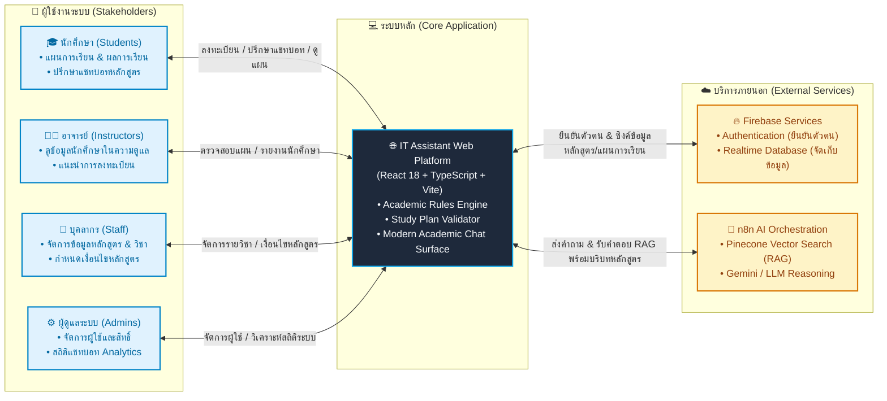
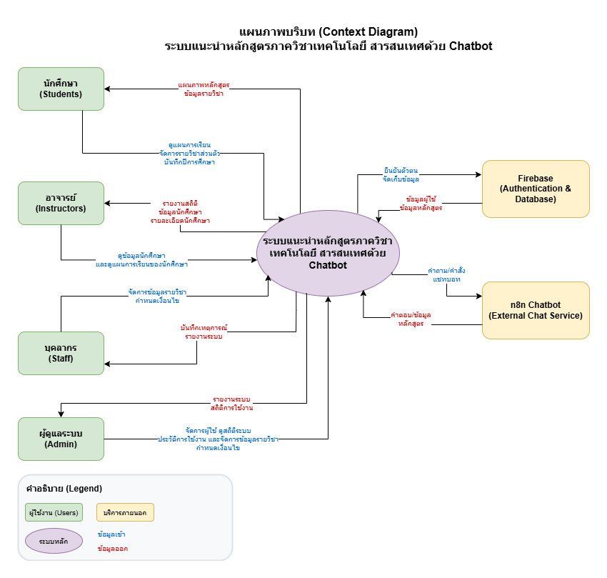
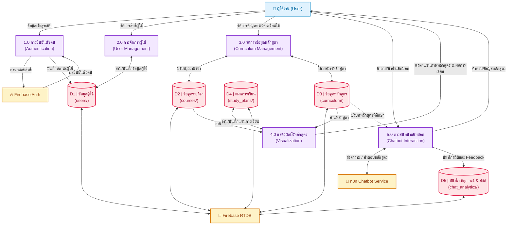
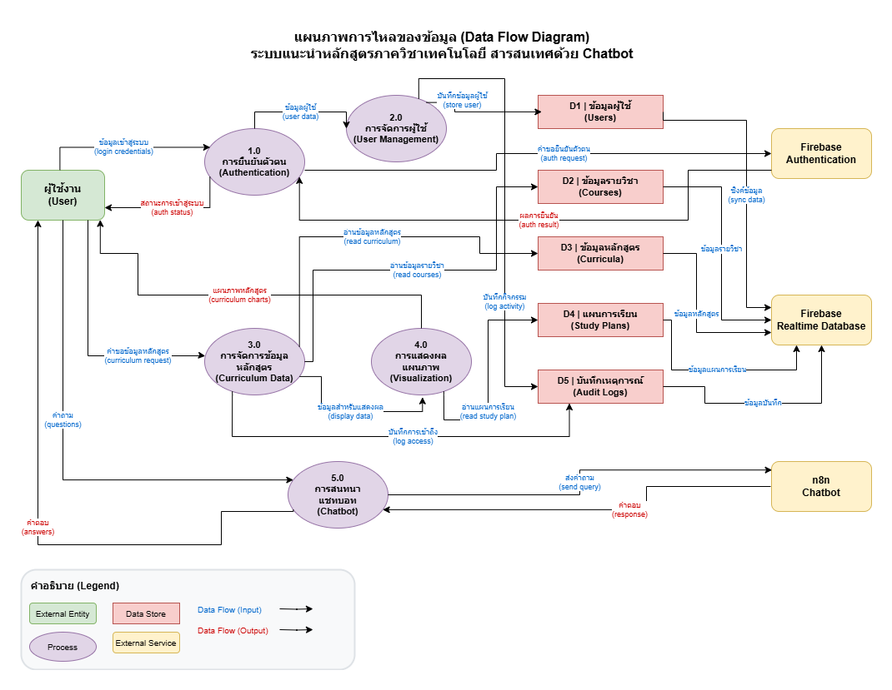
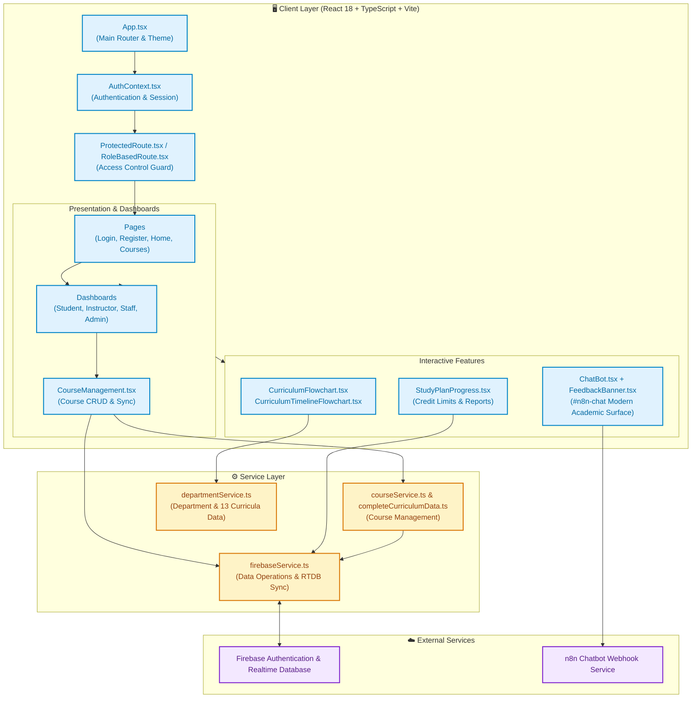
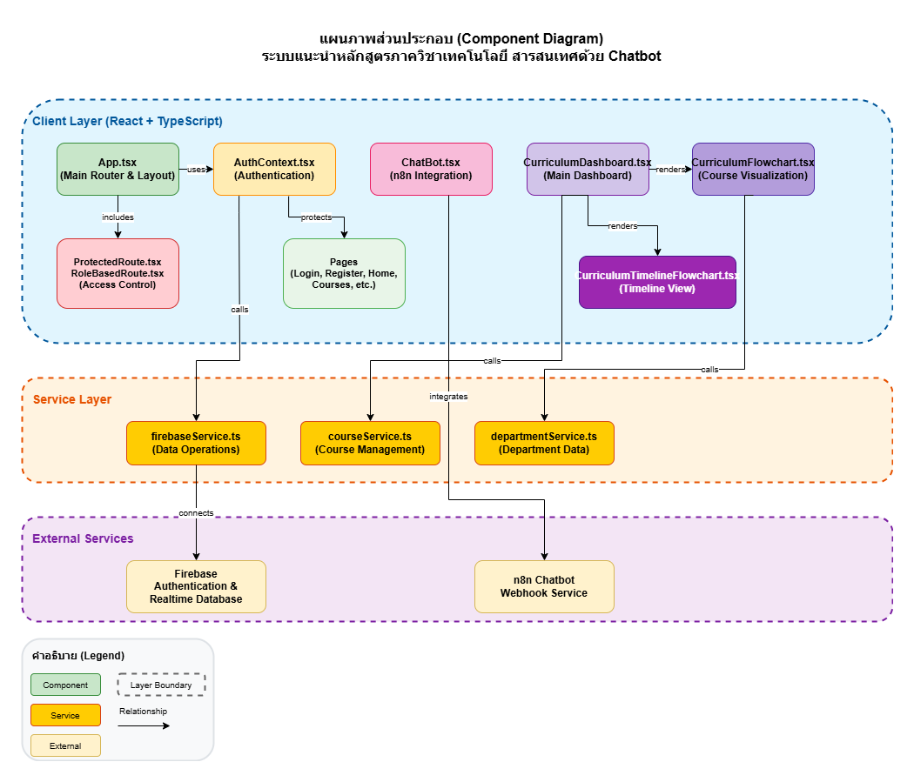
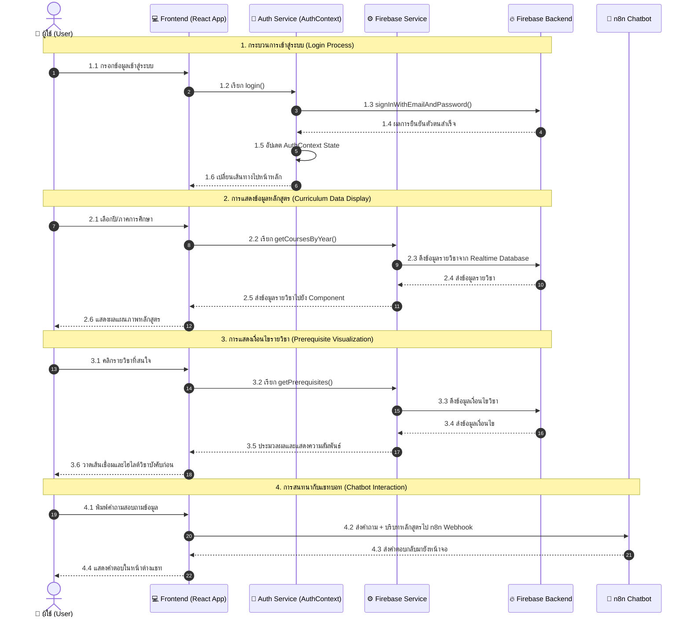
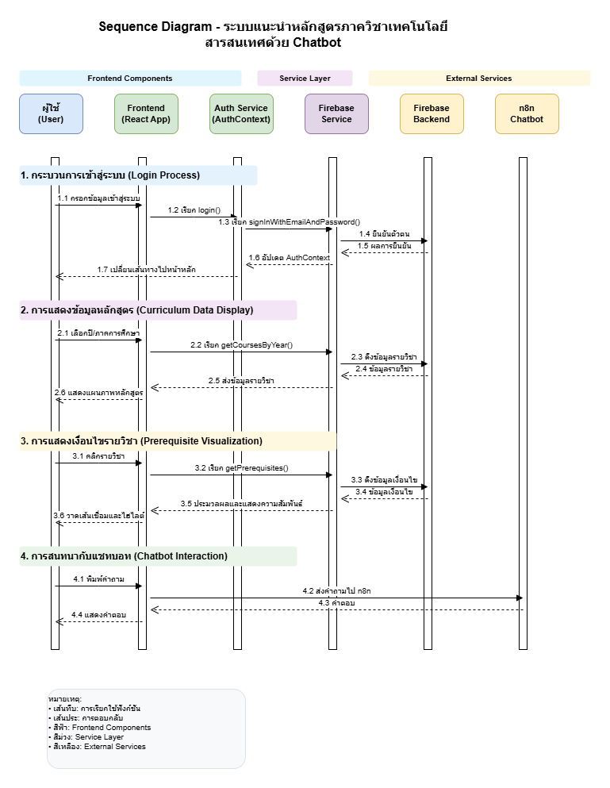

# IT Assistant
### ผู้ช่วยวางแผนการเรียนและสืบค้นข้อมูลหลักสูตรอัจฉริยะ
**ภาควิชาเทคโนโลยีสารสนเทศ · คณะเทคโนโลยีและการจัดการอุตสาหกรรม**  
**มหาวิทยาลัยเทคโนโลยีพระจอมเกล้าพระนครเหนือ (KMUTNB)**

---

[ภาพรวมระบบ](#ภาพรวมระบบ) · [สถาปัตยกรรมระบบ](#สถาปัตยกรรมระบบ) · [ขอบเขตหลักสูตรที่รองรับ](#ขอบเขตหลักสูตรที่รองรับ) · [ฟีเจอร์หลัก](#ฟีเจอร์และความสามารถ) · [บทบาทผู้ใช้งาน](#บทบาทและสิทธิ์ผู้ใช้งาน) · [เทคโนโลยีที่ใช้](#เทคโนโลยีและเครื่องมือ) · [การติดตั้งและเริ่มใช้งาน](#การติดตั้งและเริ่มใช้งาน) · [มาตรฐานวิศวกรรมและ adr](#มาตรฐานวิศวกรรมและการตัดสินใจ-adr) · [ความปลอดภัย](#ความปลอดภัยและการปกป้องข้อมูล)

---

## ภาพรวมระบบ

**IT Assistant** เป็นเว็บแอปพลิเคชันสำหรับการวางแผนการเรียน ตรวจสอบเงื่อนไขรายวิชา และติดตามผลการเรียนของนักศึกษา ภาควิชาเทคโนโลยีสารสนเทศ มหาวิทยาลัยเทคโนโลยีพระจอมเกล้าพระนครเหนือ พร้อมด้วยระบบแชทบอทอัจฉริยะ (AI Advising Assistant) ที่ผสานการทำงานร่วมกับ Retrieval-Augmented Generation (RAG) บน n8n workflow เพื่อช่วยตอบคำถามเกี่ยวกับหลักสูตร เงื่อนไขการลงทะเบียน และแผนการศึกษาได้อย่างแม่นยำ

ระบบได้รับการออกแบบบนรากฐานโมเดลโดเมนที่รัดกุมตาม [CONTEXT.md](CONTEXT.md) ยึดมั่นมาตรฐานความถูกต้องของกฎระเบียบวิชาการ (Academic Standing & Credit Rules) และใช้อินเทอร์เฟซโทนสีสุภาพ กรมท่า น้ำเงิน และขาว (KMUTNB Institutional Palette) รองรับการแสดงผลทั้งบนคอมพิวเตอร์ แท็บเล็ต และสมาร์ทโฟน

---

## สถาปัตยกรรมระบบ

ระบบถูกออกแบบด้วยสถาปัตยกรรมแยกส่วน (Decoupled Architecture) และนำเสนอแผนภาพตามมาตรฐาน [ADR-007](docs/adr/ADR-007-theme-adaptive-architectural-diagram-standards.md) ซึ่งรองรับการแสดงผลทั้ง **GitHub Dark Mode** และ **Light Mode** อย่างสมบูรณ์ คมชัดระดับ Vector

### แผนภาพบริบทภาพรวมระบบ (System Context Diagram)

แผนภาพแสดงสถาปัตยกรรม 3 ระดับ (Structured Tiered Flow) เชื่อมโยงกลุ่มผู้ใช้งาน, ระบบเว็บแอปพลิเคชัน และบริการคลาวด์/AI ภายนอก:



<details>
<summary>🖼️ <strong>ดูแผนภาพบริบทต้นฉบับ (Context Diagram Draw.io)</strong></summary>

<br />



</details>

<details>
<summary>🔍 <strong>ดูรายละเอียด Data Flow Diagram (DFD Level-0)</strong></summary>

<br />

แผนภาพแสดงทิศทางการไหลของข้อมูล กระบวนการประมวลผล (Processes) และแหล่งจัดเก็บข้อมูล (Data Stores D1–D5):



<br />



</details>

<details>
<summary>🔍 <strong>ดูรายละเอียด Component Diagram</strong></summary>

<br />

แผนภาพแสดงโครงสร้างการแบ่งสัดส่วนโมดูล (Modular Architecture) ภายใน Client Layer, Service Layer และการเชื่อมต่อ External Services:



<br />



</details>

<details>
<summary>🔍 <strong>ดูรายละเอียด Sequence Diagram (Chatbot & System Interaction)</strong></summary>

<br />

แผนภาพแสดงลำดับเวลาการทำงาน 4 ขั้นตอนหลัก: การเข้าสู่ระบบ, การแสดงข้อมูลหลักสูตร, การตรวจสอบเงื่อนไขวิชา และการสนทนากับแชทบอท:



<br />



</details>


---

## ขอบเขตหลักสูตรที่รองรับ

ระบบบรรจุฐานข้อมูล **CurriculumMasterCatalog** ครบถ้วนทั้ง 5 สาขาวิชา รวม 13 ฉบับหลักสูตรของภาควิชาเทคโนโลยีสารสนเทศ ป้องกันปัญหาภาพหลอนของ AI (Hallucination) โดยดึงโครงสร้างหลักสูตรและเกณฑ์หน่วยกิตที่ผ่านการรับรองแล้ว:

| สาขาวิชา (Program) | รหัส | ฉบับหลักสูตรที่รองรับ (Curricula) | ระยะเวลาศึกษา | หน่วยกิตรวม |
| :--- | :---: | :--- | :---: | :---: |
| **เทคโนโลยีสารสนเทศ**<br />_Information Technology_ | `IT` | • หลักสูตร พ.ศ. 2562 (`IT-62`)<br />• หลักสูตร พ.ศ. 2562 สหกิจศึกษา (`IT-62-COOP`)<br />• หลักสูตร พ.ศ. 2567 (`IT-67`)<br />• หลักสูตร พ.ศ. 2567 สหกิจศึกษา (`IT-67-COOP`) | 4 ปี | 120 – 127 |
| **วิศวกรรมสารสนเทศและเครือข่าย**<br />_Information and Network Engineering_ | `INE` | • หลักสูตร พ.ศ. 2562 (`INE-62`)<br />• หลักสูตร พ.ศ. 2562 สหกิจศึกษา (`INE-62-COOP`)<br />• หลักสูตร พ.ศ. 2567 (`INE-67`)<br />• หลักสูตร พ.ศ. 2567 สหกิจศึกษา (`INE-67-COOP`) | 4 ปี | 125 – 135 |
| **เทคโนโลยีสารสนเทศและเครือข่าย**<br />_Information and Network Engineering_ | `INET` | • หลักสูตร พ.ศ. 2562 (`INET-62`)<br />• หลักสูตร พ.ศ. 2567 (`INET-67`) | 3 ปี | 102 – 103 |
| **เทคโนโลยีสารสนเทศ (ต่อเนื่อง)**<br />_Information Technology (Continuing)_ | `ITI` | • หลักสูตร พ.ศ. 2561 (`ITI-61`)<br />• หลักสูตร พ.ศ. 2566 (`ITI-66`) | 2 ปี | 78 – 81 |
| **เทคโนโลยีสารสนเทศ (เทียบโอน)**<br />_Information Technology (Transfer)_ | `ITT` | • หลักสูตร พ.ศ. 2567 (`ITT-67`) | 2 ปี | 84 |

---

## ฟีเจอร์และความสามารถ

### 1. การจัดการหลักสูตรและผังการศึกษา (Curriculum & Study Plan)
- **สืบค้นและคัดกรองรายวิชา**: ค้นหาตามรหัสวิชา ชื่อวิชา หมวดหมู่วิชา (ศึกษาทั่วไป, วิชาเฉพาะ, วิชาเลือกเสรี) และเงื่อนไขวิชาบังคับก่อน (Prerequisites / Corequisites)
- **จัดทำแผนการเรียน 4 ปี (Study Plan)**: ลาก/เพิ่มรายวิชาลงในแต่ละภาคการศึกษา ตรวจสอบการผ่านวิชา และจำลองผลการลงทะเบียนล่วงหน้า
- **ตรวจสอบข้อกำหนดหน่วยกิต (Academic Validation Rules)**:
  - ภาคการศึกษาปกติ: ลงทะเบียนได้ตั้งแต่ 9 ถึง 22 หน่วยกิต
  - กรณีติดวิทยาทัณฑ์ (Probation): จำกัดไม่เกิน 16 หน่วยกิต (ต้องผ่านคำร้อง Probation Petition หากต้องการลงเกิน)
  - ภาคฤดูร้อน (Summer): จำกัดไม่เกิน 6 หน่วยกิต
  - ข้อยกเว้นภาคจบการศึกษา (Graduation Term Exemption): อนุญาตให้ลงต่ำกว่า 9 หน่วยกิตได้
- **คำนวณและสรุปผลการเรียน**: คำนวณ GPA รายภาคและ GPAX สะสม พร้อมกราฟและแถบวัดความคืบหน้า

### 2. แชทบอทแนะนำการเรียนอัจฉริยะ (Modern Academic Chat Surface)
- **เชื่อมโยงบริบทหลักสูตรอัตโนมัติ**: ส่ง Enrolled Curriculum ของนักศึกษาเข้าสู่ Prompt เพื่อให้คำตอบสอดคล้องกับหลักสูตรของตนเอง
- **รูปแบบการแสดงรายวิชามาตรฐาน (CoursePresentationFormat)**: แชทบอทจะตอบรหัสวิชาควบคู่ชื่อวิชาภาษาไทยเสมอ เช่น `060163152 การเขียนโปรแกรมเว็บ` ไม่ปล่อยรหัสวิชาลอยๆ
- **ระบบสำรวจความพึงพอใจ (Feedback System)**: ป้ายสอบถามแบบ 3 ระดับ (`dislike`, `neutral`, `like`) แสดงทุกๆ 5 ข้อความ พร้อมบันทึกสถิติเพื่อนำไปปรับปรุงคุณภาพคำตอบ

### 3. รายงานและการนำออกข้อมูล (Reporting & Exporting)
- **PDF Study Plan Report**: ส่งออกแผนการเรียนและใบสรุปหน่วยกิตเป็นเอกสาร PDF ผ่าน jsPDF และ html2canvas
- **Excel Spreadsheet Export**: ส่งออกรายการวิชาและแผนการเรียนเป็นไฟล์ `.xlsx` ผ่าน SheetJS

### 4. เครื่องมือสำหรับบุคลากรและผู้ดูแลระบบ (Staff & Admin Tools)
- **Course & Curriculum Management**: จัดการข้อมูลรายวิชา ปรับปรุงเงื่อนไขรายวิชา และซิงค์โครงสร้างข้อมูลระหว่าง `curriculum/` และ `courses/`
- **Student Mentoring View**: อาจารย์ที่ปรึกษาสามารถสืบค้นและดูแผนการเรียนของนักศึกษาในความดูแลเพื่อแนะนำการลงทะเบียน
- **Chat Analytics Dashboard**: รายงานสถิติการใช้งานแชทบอท คำถามยอดนิยม สัดส่วนความพึงพอใจ และการส่งออกข้อมูลการสนทนา

---

## บทบาทและสิทธิ์ผู้ใช้งาน

| บทบาท (Role) | สิทธิ์และการใช้งานหลัก |
| :--- | :--- |
| **นักศึกษา (Student)** | • วางแผนการเรียน บันทึกผลการเรียน และตรวจสอบสถานะหน่วยกิตของตนเอง<br />• ใช้งานแชทบอทเพื่อสอบถามข้อมูลหลักสูตรและการลงทะเบียน<br />• ส่งออกเอกสารแผนการเรียนในรูปแบบ PDF และ Excel |
| **อาจารย์ที่ปรึกษา (Instructor)** | • เรียกดูรายชื่อและค้นหาข้อมูลนักศึกษาในความดูแล<br />• ตรวจสอบแผนการเรียนและประวัติการลงทะเบียนของนักศึกษาเพื่อให้คำปรึกษา |
| **เจ้าหน้าที่ภาควิชา (Staff)** | • จัดการฐานข้อมูลรายวิชา เงื่อนไขวิชา และหลักสูตรในระบบ<br />• ดูข้อมูลสถิติภาพรวมและการสำรวจหลักสูตร |
| **ผู้ดูแลระบบ (Admin)** | • จัดการบัญชีผู้ใช้งานและกำหนดสิทธิ์ (Role Assignment)<br />• ตรวจสอบภาพรวมระบบและวิเคราะห์ผลตอบรับของแชทบอท (Chat Analytics) |

---

## เทคโนโลยีและเครื่องมือ

- **Frontend Core:** React 18.3, TypeScript 5.8, Vite 5.4
- **UI & Styling:** Tailwind CSS 3.4, shadcn/ui, Radix UI Primitives, Lucide Icons
- **State & Data Synchronization:** TanStack React Query 5.83, React Router 6.30
- **Database & Authentication:** Firebase Authentication, Firebase Realtime Database
- **AI & Automation Workflow:** n8n Workflow Orchestration, Pinecone Vector Database, Gemini / LLM API
- **Document & Export Services:** jsPDF 3.0, html2canvas 1.4, SheetJS (xlsx) 0.18
- **Data Validation & Forms:** Zod 3.25, React Hook Form 7.61

---

## การติดตั้งและเริ่มใช้งาน

### 1. ความต้องการของระบบ (Prerequisites)

- **Node.js**: เวอร์ชัน 18.x หรือสูงกว่า
- **npm** หรือ **bun**: ตัวจัดการแพ็กเกจ
- **Firebase Project**: ที่เปิดใช้งาน Authentication (Email/Password) และ Realtime Database
- **n8n Instance / Webhook URL**: สำหรับรองรับการประมวลผลของแชทบอท

### 2. การติดตั้งโปรเจกต์ (Installation)

```bash
# โคลนคลังข้อมูล
git clone https://github.com/kainapatkmutnb/it-course-chatbot-main.git
cd it-course-chatbot-main

# ติดตั้งแพ็กเกจและ dependencies
npm ci
```

### 3. การตั้งค่าตัวแปรสภาพแวดล้อม (Environment Configuration)

สร้างไฟล์ `.env` จากตัวอย่าง `.env.example`:

```bash
# macOS / Linux
cp .env.example .env

# Windows PowerShell
Copy-Item .env.example .env
```

#### ตารางแจกแจงตัวแปรใน `.env`

| ตัวแปร | ความจำเป็น | คำอธิบาย |
| :--- | :---: | :--- |
| `VITE_FIREBASE_API_KEY` | **จำเป็น** | Firebase Web API Key |
| `VITE_FIREBASE_AUTH_DOMAIN` | **จำเป็น** | Firebase Authentication Domain (เช่น `<project>.firebaseapp.com`) |
| `VITE_FIREBASE_DATABASE_URL` | **จำเป็น** | Firebase Realtime Database URL (เช่น `https://<project>-default-rtdb.asia-southeast1.firebasedatabase.app/`) |
| `VITE_FIREBASE_PROJECT_ID` | **จำเป็น** | Firebase Project ID |
| `VITE_FIREBASE_STORAGE_BUCKET` | **จำเป็น** | Firebase Storage Bucket URL |
| `VITE_FIREBASE_MESSAGING_SENDER_ID`| **จำเป็น** | Firebase Cloud Messaging Sender ID |
| `VITE_FIREBASE_APP_ID` | **จำเป็น** | Firebase Web App ID |
| `VITE_N8N_WEBHOOK_URL` | **จำเป็น** | Production Webhook URL ของ n8n สำหรับรับ-ส่งข้อความแชทบอท |
| `VITE_N8N_SUMMARY_WEBHOOK_URL` | ทางเลือก | Webhook URL สำหรับ workflow สรุปข้อมูลการสนทนา |

> [!WARNING]
> ห้าม Commit ไฟล์ `.env` หรือส่งต่อ Private Key เข้าสู่ Git Repository โดยเด็ดขาด ตรวจสอบ URL ของฐานข้อมูลและ Project ID ให้ตรงกับ Environment ก่อนทำการบันทึกข้อมูลเสมอ

### 4. การรันระบบในเครื่อง (Local Development)

```bash
# เริ่มต้น Development Server
npm run dev
```

เปิดเว็บเบราว์เซอร์ที่ [http://localhost:8080](http://localhost:8080) (หรือตาม Port ที่ Vite ระบุใน Terminal)

### 5. การทดสอบด้วย Firebase Emulator

โปรเจกต์มีระบบจำลอง Firebase ในเครื่องเพื่อความปลอดภัยในการทดสอบ CRUD:

```bash
# Terminal 1: เริ่มต้น Firebase Local Emulator (Auth + Database)
npm run firebase:emulators

# Terminal 2: รันเว็บแอปใน Test Mode ที่เชื่อมกับ Emulator
npm run dev:emulator
```

> [!NOTE]
> การรันในโหมด Emulator ต้องใช้ `.env.test` ที่มี Project ID ในรูปแบบ `demo-*` (เช่น `demo-it-course-chatbot`) ระบบจะปฏิเสธการเชื่อมต่อไปยังฐานข้อมูลจริงเพื่อป้องกันข้อมูลเสียหาย

### 6. การนำเข้าข้อมูลหลักสูตร (Curriculum Data Migration)

หากต้องการตั้งค่าข้อมูลรายวิชาและโครงสร้างหลักสูตรเริ่มต้นเข้าสู่ Realtime Database:

```bash
npm run migrate:curriculum
```

### 7. การตรวจสอบโค้ดและสร้าง Production Build

```bash
# ตรวจสอบ Linting
npm run lint

# สร้าง Production Bundle
npm run build

# ทดสอบรัน Production Bundle ในเครื่อง
npm run preview
```

---

## โครงสร้างไดเรกทอรี

```text
it-course-chatbot-main/
├── diagrams/                # แผนภาพสถาปัตยกรรม (Context, DFD, Component, Sequence)
├── docs/
│   ├── adr/                 # Architecture Decision Records (ADR-001 ถึง ADR-006)
│   ├── audits/              # รายงานผลการตรวจสอบระบบ (CRUD Audit, Navigation QA)
│   └── superpowers/         # บันทึกแผนการพัฒนาและแบบร่างระบบ
├── public/                  # Static Assets และฟอนต์ภาษาไทย
├── src/
│   ├── components/          # UI Components
│   │   ├── chat/            # โมดูลแชทบอทและแบนเนอร์ Feedback
│   │   ├── curriculum/      # ผังหลักสูตรและ Flowchart รายวิชา
│   │   ├── dashboard/       # แดชบอร์ดตามสิทธิ์ (Admin, Staff, Instructor, Student)
│   │   ├── layout/          # โครงหน้าเว็บ Header, Footer และ Navigation
│   │   ├── study-plan/      # ตัวจัดการแผนการเรียนและระบบคำนวณหน่วยกิต
│   │   └── ui/              # shadcn / Radix UI Design System Primitives
│   ├── contexts/            # Context Providers (Auth, System State)
│   ├── hooks/               # Custom React Hooks
│   ├── pages/               # Routing Page Components
│   ├── services/            # บริการเชื่อมต่อ Firebase, n8n และหลักสูตร
│   ├── types/               # TypeScript Interfaces และ Type Definitions
│   └── utils/               # ฟังก์ชันคำนวณหน่วยกิตและโมดูล Export PDF/Excel
├── CONTEXT.md               # Ubiquitous Language & Domain Model ของระบบ
├── database.rules.json      # กฎความปลอดภัย Firebase Realtime Database Rules
├── N8N_PREREQUISITES_GUIDE.md # คู่มือการตั้งค่า n8n Webhook และ Vector Database
└── package.json             # โปรเจกต์สคริปต์และรายการ Dependencies
```

---

## มาตรฐานวิศวกรรมและการตัดสินใจ (ADR)

ระบบนี้พัฒนาโดยยึดหลักการออกแบบเชิงสถาปัตยกรรมและบันทึกการตัดสินใจที่สำคัญผ่าน **Architecture Decision Records (ADR)**:

| รหัสเอกสาร | หัวข้อการตัดสินใจ (Architectural Decision) | สถานะ |
| :---: | :--- | :---: |
| [ADR-001](docs/adr/ADR-001-custom-course-code-and-dynamic-years.md) | รองรับรหัสวิชาแบบกำหนดเองและปีหลักสูตรแบบไดนามิก | **Accepted** |
| [ADR-002](docs/adr/ADR-002-chat-feedback-system-and-admin-analytics.md) | ระบบสำรวจความพึงพอใจการสนทนาและแดชบอร์ดวิเคราะห์ผล | **Accepted** |
| [ADR-003](docs/adr/ADR-003-chatbot-toggle-ux-and-branding.md) | มาตรฐานปุ่มเปิด-ปิดแชทบอทและการนำเสนอแบรนด์ภาควิชา | **Accepted** |
| [ADR-004](docs/adr/ADR-004-toast-alert-redesign-and-positioning.md) | การออกแบบการแจ้งเตือน Toast แจ้งเตือนสถานะและตำแหน่งแสดงผล | **Accepted** |
| [ADR-005](docs/adr/ADR-005-registration-credit-limits-and-probation-rules.md) | ขอบเขตหน่วยกิตการลงทะเบียนและเกณฑ์การควบคุมภาวะวิทยาทัณฑ์ | **Accepted** |
| [ADR-006](docs/adr/ADR-006-multi-curriculum-context-resolution-and-catalog-injection.md) | กลไกชี้ขาดบริบทหลักสูตรและการป้อนข้อมูลแคตตาล็อกสู่ n8n | **Accepted** |
| [ADR-007](docs/adr/ADR-007-theme-adaptive-architectural-diagram-standards.md) | มาตรฐานไดอะแกรมสถาปัตยกรรมแบบปรับตามธีม (Dark/Light Mode) และการใช้ Native Mermaid | **Accepted** |

### รายงานการตรวจสอบคุณภาพ (Quality Assurance & Audits)

- [Firebase CRUD & Credit Validation Audit](docs/audits/firebase-crud-credit-audit.md) — ผลการตรวจสอบความถูกต้องของการบันทึกข้อมูลและคำนวณหน่วยกิต (อัตราผ่าน 100%, 8/8 การทดสอบ)
- [Responsive Navigation & Student Flow QA](docs/audits/mobile-navigation-student-qa.md) — ผลการทดสอบการใช้งานบนอุปกรณ์พกพาและการนำทางของผู้ใช้นักศึกษา

---

## ความปลอดภัยและการปกป้องข้อมูล

1. **การยืนยันตัวตนและการจำกัดสิทธิ์**: ตรวจสอบบัญชีผู้ใช้ผ่าน Firebase Authentication และจำกัดอีเมลเฉพาะโดเมนที่กำหนดของมหาวิทยาลัย
2. **การควบคุมการเข้าถึงฐานข้อมูล**: ใช้ Firebase Realtime Database Security Rules (`database.rules.json`) ป้องกันการเขียนข้อมูลข้ามสิทธิ์ โดยมีเฉพาะ Admin และ Staff เท่านั้นที่แก้ไขโครงสร้างรายวิชาได้
3. **การแยกสิ่งแวดล้อมการพัฒนา**: ป้องกันข้อมูลสูญหายด้วยการบังคับให้โหมดทดสอบรันเฉพาะบน Local Firebase Emulator (`demo-*`)
4. **ความปลอดภัยของ AI Webhook**: ส่งข้อมูลเฉพาะบริบทที่จำเป็นในการตอบคำถาม และไม่จัดเก็บข้อมูลส่วนตัวที่ไม่เกี่ยวข้องใน Vector Database

---

<div align="center">

**ภาควิชาเทคโนโลยีสารสนเทศ**  
คณะเทคโนโลยีและการจัดการอุตสาหกรรม · มหาวิทยาลัยเทคโนโลยีพระจอมเกล้าพระนครเหนือ  
*Department of Information Technology, Faculty of Industrial Technology and Management, KMUTNB*

</div>
