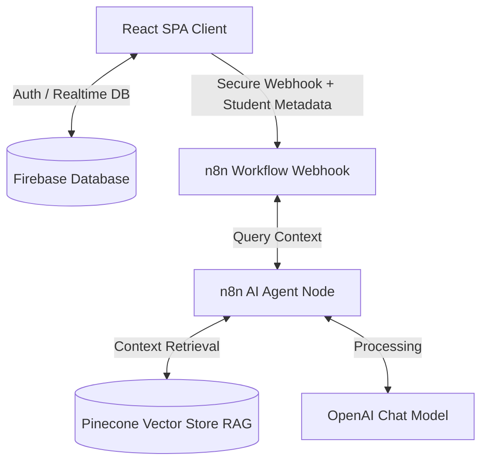

# IT Assistant

ระบบวางแผนการเรียนและช่วยเหลือข้อมูลหลักสูตร คณะเทคโนโลยีสารสนเทศ มหาวิทยาลัยเทคโนโลยีพระจอมเกล้าพระนครเหนือ (KMUTNB)

---

## 🔍 ภาพรวมระบบ (System Architecture)

ระบบประกอบด้วยเว็บแอปพลิเคชัน (React + TypeScript) ทำหน้าที่จัดการข้อมูลโครงสร้างการเรียน ดึงข้อมูลประวัติส่วนตัวและแผนการเรียนจาก Firebase Realtime Database ส่งต่อไปยังระบบประมวลผลคำถามด้วย AI Agent ผ่าน n8n Webhook และค้นหาเงื่อนไขรายวิชาด้วย Pinecone Vector Database (RAG)



---

## ⚡ คุณลักษณะสำคัญ (Core Features)

### 1. ระบบจัดการแผนการเรียนส่วนบุคคล (Interactive Study Plan Manager)
- **Interactive Study Plan:** วางแผนรายวิชาเรียน ติดตามความก้าวหน้ารายเทอมและรายปี ย้ายเทอมวิชาเรียนได้ตามต้องการ
- **Unified Academic GPA Calculator:** คำนวณเกรดเฉลี่ยสะสม (GPA) ตามเกณฑ์สถาบันอย่างถูกต้อง โดยเกรด `S` (Satisfactory) ให้นับสะสมหน่วยกิต (`completedCredits`) แต่ไม่นำไปหารคิด GPA
- **Multi-Curriculum Standard Support:** รองรับคำนวณยอดหน่วยกิตรวมตามหลักสูตรจริงของนักศึกษาจาก 5 สาขาวิชา รวม 9 รูปแบบหลักสูตร (`IT-62`, `IT-62 สหกิจ`, `IT-67`, `IT-67 สหกิจ`, `INE-62`, `INE-62 สหกิจ`, `INE-67`, `INE-67 สหกิจ`, `INET-62`, `INET-67`, `ITI-61`, `ITI-66`, `ITT-67`)
- **Dynamic Course Status Tracking:** บันทึกและปรับเปลี่ยนสถานะรายวิชาได้ยืดหยุ่น 4 สถานะ: `วางแผนเรียน` (Planned), `กำลังเรียน` (In Progress), `เรียนจบแล้ว` (Completed), และ `ไม่ผ่าน` (Failed)

### 2. แผงสถิติการเรียน 5 มิติ (5-Metric Learning Statistics Dashboard & Profile)
- **Real-Time Academic Metrics:** แสดงสถิติการเรียนของผู้ใช้งานแบบ Real-time ครอบคลุม 5 มิติสำคัญ:
  1. **หน่วยกิตที่เรียนแล้ว** (Completed Credits)
  2. **เกรดเฉลี่ยสะสม** (GPA)
  3. **วิชาที่เรียนผ่านแล้ว** (Completed Courses Count)
  4. **วิชาที่กำลังเรียน** (In-Progress Courses Count)
  5. **ความคืบหน้าการศึกษา (%)** (Progress Percentage)

### 3. แผนภูมิโครงสร้างหลักสูตร (Curriculum Flowchart)
- **Visual Chart Configurations:** แสดงรายวิชาในรูปแบบตารางเรียนมาตรฐาน (Grid View) หรือไทม์ไลน์ความสัมพันธ์ (Timeline View)
- **Interactive Prerequisite Lines:** แสดงเส้นเชื่อมโยงวิชาบังคับก่อนหน้า (Prerequisites) และวิชาเรียนควบคู่ (Corequisites) แบบ Visual

### 4. ระบบแชทบอทอัจฉริยะแบบ Real-Time Data Sync (n8n AI Assistant & Firebase Integration)
- **Real-Time Metadata Sync:** ซิงก์ข้อมูลโปรไฟล์, เกรดเฉลี่ย (GPA), ยอดหน่วยกิตผ่าน, รายวิชาที่ผ่าน และวิชาที่กำลังเรียนส่งไปยัง n8n AI Agent แบบ Real-time ทุกครั้งที่มีการอัปเดตแผนการเรียน
- **Context-Aware Responses:** บอทตอบคำถามสถิติการเรียนส่วนตัว รายวิชาที่ขาด และคำแนะนำการลงทะเบียนวิชาถัดไปได้อย่างแม่นยำตรงกับหน้า Dashboard และ Profile 100%
- **Automated Curriculum Comparison:** เปรียบเทียบแผนการเรียนจริงของนักศึกษากับหลักสูตรมาตรฐาน เพื่อหาและรายงานรายวิชาบังคับที่ยังไม่ได้ศึกษา
- **Role-Based Security Guard:** กรองสิทธิ์การเข้าถึงข้อมูลรายวิชา หากเป็นผู้เยี่ยมชม (Guest Mode) ระบบจะจำกัดการดูข้อมูลส่วนตัว และค้นหาข้อมูลวิชาเรียนทั่วไปผ่าน Pinecone RAG เท่านั้น

---

## 👥 ตารางสิทธิ์เข้าใช้งานระบบ (Role & Permissions Matrix)

| บทบาทผู้ใช้ (Role) | สิทธิ์การทำงานหลัก |
| :--- | :--- |
| **นักศึกษา (Student)** | - จัดการแผนการเรียนส่วนตัว<br>- บันทึกปีการศึกษาและข้อมูลรายวิชาเรียนผ่าน<br>- ใช้งานแชทบอท AI แบบรู้จำข้อมูลส่วนตัว |
| **อาจารย์ (Instructor)** | - เข้าถึงรายชื่อและข้อมูลนักศึกษาที่รับผิดชอบ<br>- ติดตามความก้าวหน้าแผนการเรียนและแก้ไขสถานะข้อมูลนักศึกษา |
| **บุคลากร (Staff)** | - บริหารจัดการโครงสร้างรายวิชาส่วนกลาง<br>- กำหนดเงื่อนไขวิชาเรียน (Prerequisites/Corequisites) |
| **ผู้ดูแลระบบ (Admin)** | - ตรวจสอบความปลอดภัยระบบผ่านระบบ Audit Logs<br>- บริหารจัดการบัญชีผู้ใช้งานและจัดการสิทธิ์ทั้งหมด |

---

## 🛠️ เทคโนโลยีที่ใช้ (Tech Stack)

### หน้าบ้าน (Frontend)
- **Core:** React 18, TypeScript, Vite
- **Styling:** Tailwind CSS, shadcn/ui (Radix UI)
- **Routing & State:** React Router DOM, TanStack React Query (React Query v5)
- **Visualization & Export:** Recharts, html2canvas, jsPDF

### หลังบ้าน (Backend & Database)
- **Database & Auth:** Firebase Authentication, Firebase Realtime Database
- **Hosting:** Firebase Hosting

### ระบบ AI & Chatbot
- **Workflow Automation:** n8n Workflow Webhook
- **Vector Database:** Pinecone Vector Store (RAG)
- **LLM Engine:** OpenAI Chat Model (`gpt-5-nano` / `gpt-4o-mini`)

---

## 🚀 การติดตั้งและใช้งาน (Installation Guide)

### ข้อกำหนดเบื้องต้น (Prerequisites)
- **Node.js** (เวอร์ชัน 18 ขึ้นไป)
- **Firebase Project** ที่เปิดใช้งาน Realtime Database และ Authentication
- **n8n Webhook URL** (สำหรับการใช้แชทบอท AI)

### ขั้นตอนการทำงาน

1. **ดาวน์โหลดโครงการและติดตั้ง Dependencies**
   ```bash
   git clone <repository-url>
   cd it-course-chatbot-main
   npm install
   ```

2. **ตั้งค่าไฟล์สภาพแวดล้อม (Environment Variables)**
   สร้างไฟล์ `.env` ไว้ที่โฟลเดอร์หลัก (Root Directory) และระบุข้อมูลดังนี้:
   ```env
   VITE_FIREBASE_API_KEY=your_firebase_api_key
   VITE_FIREBASE_AUTH_DOMAIN=your_firebase_auth_domain
   VITE_FIREBASE_DATABASE_URL=your_firebase_database_url
   VITE_FIREBASE_PROJECT_ID=your_firebase_project_id
   VITE_FIREBASE_STORAGE_BUCKET=your_firebase_storage_bucket
   VITE_FIREBASE_MESSAGING_SENDER_ID=your_firebase_messaging_sender_id
   VITE_FIREBASE_APP_ID=your_firebase_app_id
   VITE_N8N_WEBHOOK_URL=your_n8n_chat_webhook_url
   ```

3. **นำเข้าข้อมูลหลักสูตรเริ่มต้นสู่ Firebase**
   ```bash
   node initialize-firebase-data.cjs
   ```

4. **เริ่มการทำงานระบบสำหรับพัฒนาพัฒนา (Local Development)**
   ```bash
   npm run dev
   ```
   *ระบบจะเปิดใช้งานที่ URL: `http://localhost:8080`*

5. **การตรวจสอบและสร้างไฟล์โปรดักชัน (Production Build)**
   ```bash
   npm run lint   # ตรวจสอบความถูกต้องของโค้ด
   npm run build  # คอมไพล์ไฟล์สำหรับ Production
   ```

---

## 📁 โครงสร้างโฟลเดอร์ที่สำคัญ (Key Directory Structure)

```text
src/
├── components/          # ส่วนประกอบอินเทอร์เฟซหลัก
│   ├── chat/            # หน้าต่างอินเทอร์เฟซแชทบอท (ChatBot.tsx)
│   ├── curriculum/      # หน้าแสดงแผนผังวิชาเรียนแบบ Grid และ Timeline
│   ├── dashboard/       # แดชบอร์ดตามบทบาทผู้ใช้งาน (Student, Instructor, Staff, Admin)
│   └── study-plan/      # ส่วนจัดการและบันทึกผลแผนการเรียน
├── contexts/            # ระบบสเตตและจัดการการล็อกอิน (AuthContext.tsx)
├── hooks/               # ตัวดึงข้อมูลความสัมพันธ์ของนักศึกษาและเกรดเฉลี่ย (useFirebaseData.ts)
├── services/            # บริการ API เชื่อมโยงข้อมูล Firebase และ Hybrid Course
└── types/               # การกำหนดชนิดตัวแปรและข้อมูล (Types)
```

---

## 🔒 กฎความมั่นคงปลอดภัย (Security Policies)
- จำกัดสิทธิ์การสมัครและเข้าใช้งานเฉพาะอีเมลภายใต้โดเมนสถาบัน `@kmutnb.ac.th` และ `@email.kmutnb.ac.th` เท่านั้น
- มีการเข้ารหัสและตรวจสอบตัวตนผ่าน Firebase Authentication ทุกเซสชัน
- บันทึกพฤติกรรมการเขียนหรือแก้ไขฐานข้อมูลวิชาผ่าน Audit Logs