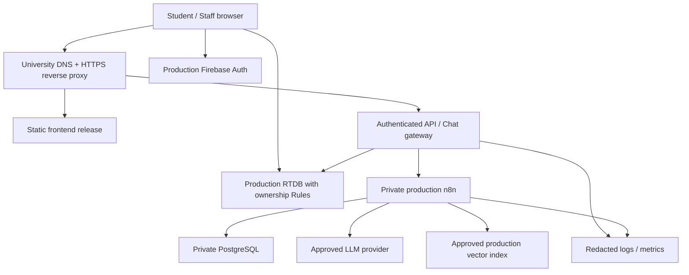

# คู่มือนำ IT Assistant ไปใช้จริงบน Infrastructure มหาวิทยาลัย

วันที่จัดทำ: **9 ตุลาคม 2026 (Asia/Bangkok)**  
อ้างอิง source baseline: **`24651cb`**  
สถานะ: **คู่มือเตรียมการและ proposed runbook — ยังไม่ใช่ระบบที่ deploy พร้อมใช้**

กลุ่มเป้าหมายคือนักศึกษาภาควิชาเทคโนโลยีสารสนเทศ มจพ. วิทยาเขตปราจีนบุรีจำนวนหลักร้อยขึ้นไป ปัจจุบัน n8n/ฐานข้อมูลเป็น Dev ผู้ใช้ระบุว่าน่าจะใช้ server มหาวิทยาลัย แต่ยังไม่ทราบรายละเอียด server และยังต้องยืนยันการใช้ Cloud กับอาจารย์/ผู้ดูแล

> อ่าน [แผนแก้ไข T01–T12](../superpowers/plans/2026-10-09-production-readiness-remediation.md) ก่อนใช้ runbook นี้ การเขียนเอกสารไม่ได้อนุมัติให้เปลี่ยนโค้ด ตั้งค่า Firebase/n8n เปิด firewall หรือ deploy ขณะนี้ source มี release blockers ด้านสิทธิ์และข้อมูล จึงยังไม่ควรเปิดรับข้อมูลนักศึกษาจริง

## 1. เลือกสาขาให้ตรงสิทธิ์เซิร์ฟเวอร์จริง

| สิ่งที่มหาวิทยาลัยให้ | ใช้ทำอะไรได้ | ขั้นต่อไป |
|---|---|---|
| Linux VM พร้อม SSH/service permission | static frontend, API gateway และ n8n ตาม resource/policy | ใช้สาขา VM ด้านล่างหลังผู้ดูแลอนุมัติ |
| เฉพาะ web space / upload `dist` | ให้บริการ React static files | ต้องขอ runtime สำหรับ API/n8n แยก หรือขออนุมัติบริการภายนอก; static hosting อย่างเดียวรัน Node/n8n ไม่ได้ |
| Reverse proxy ส่วนกลาง + VM ภายใน | มหาวิทยาลัยทำ TLS ส่วน VM รัน app | ให้ผู้ดูแลกำหนด trusted proxy/IP/headers; ห้ามวาง TLS config ตัวอย่างซ้ำโดยไม่ประสาน |
| Windows/IIS หรือระบบจัดการอื่น | ขึ้นกับสิทธิ์ที่ได้รับ | ให้ผู้ดูแลแปลง SPA rewrite/API proxy/service management ตามแพลตฟอร์ม; Nginx commands ในเอกสารนี้ใช้ไม่ได้ตรง ๆ |
| ใช้ได้เฉพาะระบบภายใน ห้าม Cloud | frontend self-host ได้ แต่ Firebase/Auth/LLM/vector เดิมไม่ตรงนโยบาย | **หยุด deployment ตาม architecture นี้** ต้องมีแผนเปลี่ยน identity/database/model/vector และงบดูแลแยก |

การวางหน้าเว็บบน server มหาวิทยาลัย **ไม่ได้ย้าย Firebase หรือข้อมูลที่ส่ง LLM มาไว้ในมหาวิทยาลัย** ปัจจุบัน browser เชื่อม Firebase โดยตรงด้วย จึงต้องตรวจทั้งการออกอินเทอร์เน็ตจาก server และจากเครือข่ายของผู้ใช้

### แบบสอบถามที่ส่งให้อาจารย์/ผู้ดูแลได้

1. ได้ VM หรือ web space? OS/version, CPU/RAM/disk/quota, SSH/sudo และ Docker Compose ได้หรือไม่?
2. ใครเป็นเจ้าของ domain/DNS/TLS renewal? ได้ subdomain ที่ root `/` หรือ path เช่น `/it-assistant/`?
3. เข้าได้จากภายนอกมหาวิทยาลัยหรือเฉพาะ campus/VPN? มี load balancer/reverse proxy/WAF อยู่แล้วหรือไม่?
4. เปิด outbound HTTPS ไป Firebase/Auth, LLM provider และ vector provider ได้หรือไม่? ต้องใช้ proxy หรือ CA ภายในหรือไม่?
5. อนุมัติบริการ Cloud ใด และส่งข้อมูลนักศึกษาชนิดใดออกได้? ใครอนุมัติ privacy/retention?
6. มี production Firebase project/billing owner หรือให้ตั้งใหม่? ใครมีสิทธิ์ deploy Rules และจัดการ Auth?
7. n8n ให้รันบน VM นี้หรือระบบกลาง? ใครดูแล PostgreSQL, credentials, backups และ patching?
8. มี Git/CI/artifact registry ของมหาวิทยาลัยหรือไม่? ใครอนุมัติ deployment และถือ production secrets?
9. เวลาให้บริการที่ต้องการ, ข้อมูลสูญหายได้สูงสุดเท่าไร (RPO), และกู้กลับภายในกี่ชั่วโมง (RTO)?
10. คาดการณ์ช่วงใช้งานสูงสุด เช่น ก่อนลงทะเบียน และเพดานค่าใช้จ่าย LLM ต่อวัน/เดือนเท่าไร?

เก็บคำตอบเป็น environment inventory ที่จำกัดสิทธิ์ ไม่ใส่ password/token ใน Markdown หรือ Git ในขณะนี้คำตอบข้อ server และ Cloud ยังไม่ทราบ จึงยังไม่มี production hostname/IP/version ที่ยืนยันแล้ว

## 2. ระบบปัจจุบันกับระบบเป้าหมาย

### ตรวจได้จาก Repository

- `package.json:8`: frontend build เป็น `vite build` ไม่ได้ตรวจ type โดยอัตโนมัติ
- `firebase.json`: มี RTDB Rules และ Auth/DB emulator; ไม่มี static hosting deployment
- `src/config/firebase.ts:19` และ `src/services/firebaseService.ts:8`: มี fallback ไป database ของ Dev
- `src/components/chat/ChatBot.tsx:108`: fallback webhook เป็น localhost
- ไม่มี `server/`, `deploy/compose.yaml`, `deploy/nginx.conf` หรือ n8n workflow export ที่พร้อม deploy ใน baseline
- TypeScript app มี 22 diagnostics, lint 137 errors/35 warnings ใน assessment เดิม; in-memory bundle ผ่าน แต่ไม่ใช่ readiness gate
- main JS ประมาณ 3.74 MB หรือ gzip 973 KB; ต้องทดสอบบนอุปกรณ์/เครือข่ายจริง

### Architecture ที่เสนอเมื่อ Cloud ได้รับอนุมัติ



เริ่มแบบ single API/n8n instance พร้อม concurrency/cost limits ได้เมื่อ load test รองรับ หากต้องเพิ่มหลาย replicas ให้ทำ shared rate limiting/idempotency/session ownership store ก่อน ส่วน Redis queue/workers เพิ่มเมื่อมี bottleneck ที่วัดได้

### คำที่ต้องใช้ให้ตรงกัน

- **Firebase UID:** ตัวระบุตัวตน; ใช้ ownership และ canonical study plan key
- **รหัสนักศึกษา:** ข้อมูลโปรไฟล์ ไม่ใช่ UID แม้ field เดิมบางแห่งชื่อ `studentId`
- **แผนการเรียนส่วนบุคคล:** ข้อมูลที่ระบบใช้แนะนำ; ต้องยืนยันสถานะความเป็นทางการกับเจ้าของระบบ
- **Release artifact:** ไฟล์ build ที่ผูกกับ commit/config digest; ไม่รวม server secrets
- **Staging:** environment แยกจาก Production ใช้ synthetic users สำหรับการตรวจรับ
- **Go-live:** เปิดให้ผู้ใช้จริงหลังผู้รับผิดชอบอนุมัติหลักฐาน ไม่ใช่เพียงเปิด URL ได้

## 3. Go/no-go ก่อนเริ่ม deployment

ดำเนินการส่วน publish ได้ต่อเมื่อรายการต่อไปนี้มีหลักฐานผ่าน:

- [ ] T02–T04: role/ownership/active-account Rules ผ่าน emulator matrix และ staged account lifecycle
- [ ] T05–T07: type/runtime errors, false success, atomic/concurrent writes และ auto-cleanup ถูกแก้
- [ ] T08–T09: gateway verify token/session, workflow export และ RAG/feedback ผ่านจริง
- [ ] T10: environment validation, dependency triage และ CI gates ผ่าน
- [ ] อนุมัติ server type, domain/base path, Cloud และข้อมูลที่ส่ง provider
- [ ] มี backup/restore/rollback owner และแผนจำกัดค่าใช้จ่าย

หากต้องแสดงงานระหว่างรอ ใช้ staging ที่จำกัดการเข้าถึงและ synthetic data ห้ามลด Rules ของข้อมูลจริงเพื่อให้ demo ทำงาน

## 4. เตรียม environments และ accounts

| รายการ | Dev / Staging / Production |
|---|---|
| Firebase | แยก project/DB/Auth/billing access; Emulator ใช้ `demo-*` เท่านั้น |
| n8n | แยก instance/database/encryption key/service credentials |
| Vector data | แยก index หรือ scope ที่ควบคุมสิทธิ์ได้และทดสอบ isolation; namespace อย่างเดียวไม่แทน credential authorization |
| LLM | แยก project/key/budget เท่าที่ provider รองรับ |
| Domain | แยก staging URL ไม่ให้ส่ง callback กลับ production |
| Users | staging เป็นบัญชีสังเคราะห์; production bootstrap admin จากรายชื่ออนุมัติ |

**Firebase setup:** เปิดเฉพาะ Auth providers ที่ใช้จริง ใส่ authorized domains ของ frontend ตั้ง Rules ที่ผ่านการทดสอบแล้ว ตรวจ Web API restrictions/App Check ตาม SDK ที่รองรับ และกำหนดสิทธิ์ operator ขั้นต่ำ App Check ช่วยลด abuse แต่ไม่ทดแทน ownership rules

**Role bootstrap:** ผู้ดูแลใช้ trusted server/Admin SDK ตั้ง authority/custom claims เฉพาะ UID ที่อนุมัติ ห้ามสร้าง Admin จากอีเมลที่มีคำว่า `admin` ห้ามเปิด public write เพื่อ seed ข้อมูล

**ข้อมูลเริ่มต้น:** migrate เฉพาะ curriculum ที่ตรวจแล้ว แผน/เกรด/log จาก Dev ไม่คัดลอกทั้งฐานเข้าจริงโดยอัตโนมัติ หากต้องย้ายมี mapping/dry-run/approval/reconciliation รายการครบ

## 5. Environment variables และ secrets

### Frontend — ค่า public ณ เวลา build

ค่าที่มีอยู่ในโค้ดปัจจุบัน:

```dotenv
VITE_FIREBASE_API_KEY=PUBLIC_FIREBASE_WEB_CONFIG_VALUE
VITE_FIREBASE_AUTH_DOMAIN=APPROVED_PRODUCTION_AUTH_DOMAIN
VITE_FIREBASE_DATABASE_URL=APPROVED_PRODUCTION_HTTPS_DATABASE_URL
VITE_FIREBASE_PROJECT_ID=APPROVED_PRODUCTION_PROJECT_ID
VITE_FIREBASE_STORAGE_BUCKET=PUBLIC_FIREBASE_STORAGE_BUCKET
VITE_FIREBASE_MESSAGING_SENDER_ID=PUBLIC_FIREBASE_MESSAGING_SENDER_ID
VITE_FIREBASE_APP_ID=PUBLIC_FIREBASE_APP_ID
VITE_USE_FIREBASE_EMULATOR=false
VITE_N8N_WEBHOOK_URL=APPROVED_HTTPS_CHAT_GATEWAY_URL
```

ค่าตัวพิมพ์ใหญ่ทางขวาเป็นชื่อช่องในแบบฟอร์ม ไม่ใช่ค่าที่นำไป deploy ได้ ให้ CI เติมจาก approved target configuration และ validator ปฏิเสธค่าแบบฟอร์ม/loopback/Dev ถ้าใช้ชื่อ `VITE_N8N_WEBHOOK_URL` ต่อหลังเพิ่ม adapter ค่านี้ชี้ **gateway** ไม่ใช่ public n8n ที่ข้าม auth

`VITE_N8N_SUMMARY_WEBHOOK_URL` มีในตัวอย่าง env แต่ไม่พบ caller ใน `src` ที่ baseline อย่าสร้างบริการเพิ่มเพียงเพราะมี env นี้ ส่วน `VITE_NODE_ENV` ไม่ควรถูกใช้ตัดสินโหมดแทน `import.meta.env.MODE/PROD`

Vite ฝังค่า `VITE_*` ใน bundle จึงอ่านได้จาก browser และต้อง build ใหม่เมื่อเปลี่ยนค่า การตั้ง env ของ Nginx หลัง upload ไม่เปลี่ยนค่าใน JavaScript [เอกสาร Vite](https://vite.dev/guide/env-and-mode)

### Server — เก็บนอก Git/web root

| ค่า | ผู้ใช้ / การจัดเก็บ |
|---|---|
| Firebase Admin identity | API; workload identity ถ้ามี หรือไฟล์ credential แบบ read-only/least privilege ที่ mount จาก secret store |
| `N8N_ENCRYPTION_KEY` | n8n; secret ที่ต้องสำรองคู่กับฐานข้อมูล และคงเดิมเมื่อ restart/restore |
| PostgreSQL credentials | n8n; private network และ secret store |
| LLM/vector keys | credentials ฝั่ง n8n/server; จำกัด project/budget/scope |
| Gateway-to-n8n credential | server-only; rotate และตรวจจาก upstream ไม่ใช่ฝังใน frontend |
| Domain/origins/limits/timeouts | runtime configuration ตาม API contract และ proxy topology ที่อนุมัติ |

ห้าม copy `.env`, `.git`, service-account JSON หรือ source tree ทั้งหมดเข้า web root สำรอง secrets แยกจาก artifact และจำกัดคนกู้คืนได้

## 6. URL root กับ subpath

**แนะนำขอ dedicated subdomain ที่ root `/`** เพราะ baseline ใช้ root-relative routes/assets อยู่หลายแห่ง หากมหาวิทยาลัยให้ subpath ต้องทำ task เพิ่มก่อน build:

| ส่วน | Root | Subpath ตัวอย่าง `/it-assistant/` |
|---|---|---|
| Vite `base` | `/` | `/it-assistant/` |
| `BrowserRouter` basename | ไม่ต้องกำหนด | `/it-assistant` |
| SPA fallback | `/index.html` | `/it-assistant/index.html` |
| Assets / favicon / home links | root-relative ใช้ได้ | ปรับให้ใช้ BASE_URL/router links |
| API URL | `/api/chat` ที่โดเมนเดียวกัน | ระบุชัดว่าจะอยู่ `/api/chat` หรือใต้ prefix; ทั้ง proxy/adapter ต้องตรงกัน |

จุดตรวจจริง: `vite.config.ts:7`, `src/App.tsx:28`, `index.html:9`, `src/components/home/HomeOverview.tsx:4`, `src/pages/NotFound.tsx:20` การเปลี่ยน proxy อย่างเดียวไม่แก้ base path ของ bundle

Acceptance: เปิด deep link `/dashboard/student` โดยตรง/refresh, login redirect, NotFound→home, image/font/favicon และ API ต้องถูก path; API 404 ต้องไม่คืน HTML ของ SPA

## 7. Build และบรรจุ artifact

คำสั่งส่วนนี้ใช้บน CI/build machine ใน checkout ของ release ที่อนุมัติ หลัง T01/T05/T10 สำเร็จ **ไม่ใช่คำสั่งที่รันไปแล้วจากการเขียนเอกสาร**

### 7.1 ตรวจที่มี command อยู่แล้ว

```bash
npm ci
node node_modules/typescript/bin/tsc -p tsconfig.app.json --noEmit
node node_modules/typescript/bin/tsc -p tsconfig.node.json --noEmit
npm run lint
```

Expected: exit 0 ทุกตัว ปัจจุบัน baseline ยังไม่ผ่าน app typecheck/lint จึงต้องหยุดก่อน publish

### 7.2 Gates ที่ต้องสร้างตามแผนก่อนใช้

```bash
npm run test:unit
npm run test:rules
npm run test:integration
npm run check:production-env
npm run build
npm run test:e2e
```

scripts `test:*` และ `check:production-env` ยังไม่มีใน baseline ให้ตรวจ `package.json` ของ release ว่ามี harness จริงแล้ว E2E ใช้ built artifact กับ emulator/staging; ไม่ใช่ production-data tests

ห้ามใช้ `npm run build:dev` หรือ `npm run dev:emulator` เป็น production build และไม่รัน root `test-course-edit.js`, `test-course-sync.js`, `test-all-fixes.js` กับ production

### 7.3 ตรวจ artifact

- `dist/index.html` และ hashed assets ต้องมี; ตรวจว่า URL ที่ bundle ใช้ตรง approved project/API/base path
- ค้นว่าไม่มี localhost webhook, dev project ID, private key, server token หรือ service-account JSON
- ตรวจขนาด gzip, JS errors และ dependency report จาก release นี้ใหม่; ไม่ใช้ baseline เป็นผลหลังแก้
- บันทึก release manifest: commit SHA, build UTC timestamp, Node/npm versions, lockfile hash, public config digest, asset checksums และ test result IDs
- ส่ง `dist` พร้อม manifest ผ่านช่องทางที่ผู้ดูแลกำหนด; artifact ที่มี secrets ถือว่าไม่ผ่านและต้อง rotate secrets ที่เกี่ยวข้อง

ตัวอย่างแพ็กไฟล์บน Linux หลังตรวจแล้ว:

```bash
tar -czf frontend-dist.tar.gz -C dist .
sha256sum frontend-dist.tar.gz
```

ใช้ `vite preview` เฉพาะตรวจ build ในเครื่อง ไม่ใช้เป็น public production server ตาม [Vite static deployment](https://vite.dev/guide/static-deploy.html)

## 8. สาขา Linux VM + Nginx

ตัวอย่างนี้สมมติผู้ดูแลอนุมัติ Linux/Nginx, dedicated root-domain และ API ฟังที่ `127.0.0.1:3001` แล้ว ยังไม่ทราบว่า server มหาวิทยาลัยตรงเงื่อนไขนี้หรือไม่

### 8.1 ขอบเขตเครือข่าย

| Port/service | การเข้าถึงที่เสนอ |
|---|---|
| 443 | ผู้ใช้ผ่าน HTTPS ตามนโยบาย campus/public |
| 80 | redirect/ACME เมื่อผู้ดูแลอนุมัติ; หาก TLS ส่วนกลางให้ทำที่ edge |
| SSH | เฉพาะ VPN/admin IP |
| API 3001 | loopback/private proxy network |
| n8n 5678 | private gateway/admin network; editor ผ่าน VPN/approved access proxy |
| PostgreSQL 5432 / Redis ถ้ามี | service network เท่านั้น |

Proxy ต้อง reset forwarded headers จาก untrusted clients และแอป trust เฉพาะ proxy ที่รู้จัก ถ้ามีหลายชั้นให้ตั้งจำนวน hops ตาม topology จริง ไม่เชื่อ `X-Forwarded-For` ที่ client ส่งเองเพื่อคิด rate limit

### 8.2 Layout ที่เสนอ

```text
/srv/it-assistant/
  releases/<approved-release-id>/    index.html, public assets, manifest
  shared/assets/                    hashed assets ของ release ปัจจุบัน/ก่อนหน้า
  current -> releases/<approved-release-id>
  previous -> releases/<last-known-good-id>
/etc/it-assistant/                   runtime config / secrets ที่จำกัดสิทธิ์
```

เก็บ hashed assets รุ่นก่อนระหว่าง rollback window เพื่อไม่ให้ browser ที่เปิด index เก่ารับ 404 เมื่อโหลด chunk เพิ่ม ออกแบบ retention cleanup แยกจาก publish และอย่าลบ volume ของ database

### 8.3 Nginx ตัวอย่างสำหรับ root-domain

`it-assistant.example.edu` และ certificate paths ต่อไปนี้เป็นตัวอย่าง ให้ผู้ดูแลแทนด้วยค่าที่อนุมัติแล้วเท่านั้น เก็บ config ที่ปรับแล้วเป็น `deploy/nginx.conf` ในงาน T11; ไฟล์นั้นยังไม่ได้ถูกสร้างโดยเอกสารนี้

```nginx
server {
    listen 80;
    server_name it-assistant.example.edu;
    return 301 https://$host$request_uri;
}

server {
    listen 443 ssl;
    server_name it-assistant.example.edu;
    ssl_certificate     /etc/it-assistant/tls/fullchain.pem;
    ssl_certificate_key /etc/it-assistant/tls/privkey.pem;
    ssl_protocols TLSv1.2 TLSv1.3;
    server_tokens off;
    root /srv/it-assistant/current;
    index index.html;
    client_max_body_size 32k;

    # Put one copy of these headers in the university-managed common include
    # if location-specific add_header settings are introduced later.
    add_header X-Content-Type-Options nosniff always;
    add_header X-Frame-Options DENY always;
    add_header Referrer-Policy strict-origin-when-cross-origin always;

    location = /api { return 404; }
    location ^~ /api/ {
        proxy_pass http://127.0.0.1:3001;
        proxy_http_version 1.1;
        proxy_set_header Host $host;
        proxy_set_header X-Forwarded-Proto $scheme;
        proxy_set_header X-Forwarded-For $remote_addr;
        proxy_set_header X-Request-ID $request_id;
        proxy_connect_timeout 5s;
        proxy_read_timeout 60s;
        proxy_send_timeout 60s;
        proxy_buffering off;
        proxy_cache off;
    }

    location /assets/ {
        root /srv/it-assistant/shared;
        try_files $uri =404;
        expires 1y;
    }
    location = /index.html {
        expires -1;
    }
    location / {
        try_files $uri $uri/ /index.html;
    }
    location ~ /\. { deny all; }
}
```

ทดสอบ `nginx -t` บน server จริงก่อน reload; ตัวอย่างยังไม่ได้ตรวจบน server มหาวิทยาลัย หาก TLS terminate ที่ส่วนกลางให้ผู้ดูแลปรับ listener/certificate/forwarding ทั้งสองชั้นร่วมกัน

เพิ่ม CSP หลังทำ resource inventory ของ Firebase Auth, RTDB (รวม WebSocket), API, images/fonts และทดสอบ Google login; เริ่ม report-only แล้วปรับ enforce ห้ามใส่ wildcard เพื่อให้ error หายโดยไม่ตรวจ เปิด HSTS หลังยืนยัน HTTPS/renewal และขอบเขต subdomain แล้ว

หลักการ SPA fallback อ้างอิง [Nginx try_files](https://nginx.org/en/docs/http/ngx_http_core_module.html#try_files)

### 8.4 Publish static release หลังผ่าน gates

ผู้ดูแลต้องสร้าง layout/ownership ให้ deploy account เขียนได้ และให้ web server อ่านได้ก่อน ตัวอย่างนี้เป็น Bash บน Linux; ไม่รันใน PowerShell ของเครื่องพัฒนา

```bash
set -euo pipefail
APP_ROOT=/srv/it-assistant
read -r -p 'Approved release ID (letters/numbers/dot/underscore/hyphen): ' RELEASE_ID
[[ "$RELEASE_ID" =~ ^[A-Za-z0-9][A-Za-z0-9._-]*$ ]] || exit 1
test -f frontend-dist.tar.gz
test -d "$APP_ROOT/releases"
test ! -e "$APP_ROOT/releases/$RELEASE_ID"
mkdir "$APP_ROOT/releases/$RELEASE_ID"
tar -xzf frontend-dist.tar.gz -C "$APP_ROOT/releases/$RELEASE_ID"
test -f "$APP_ROOT/releases/$RELEASE_ID/index.html"
mkdir -p "$APP_ROOT/shared/assets"
rsync -a "$APP_ROOT/releases/$RELEASE_ID/assets/" "$APP_ROOT/shared/assets/"
# Keep the old target for rollback; current must be a symlink or absent.
if test -e "$APP_ROOT/current" || test -L "$APP_ROOT/current"; then
    test -L "$APP_ROOT/current"
    ln -sfn "$(readlink "$APP_ROOT/current")" "$APP_ROOT/previous"
fi
test ! -e "$APP_ROOT/current.next"
test ! -L "$APP_ROOT/current.next"
ln -s "$APP_ROOT/releases/$RELEASE_ID" "$APP_ROOT/current.next"
mv -Tf "$APP_ROOT/current.next" "$APP_ROOT/current"
```

ก่อนแตก archive ให้ตรวจ checksum กับ manifest ที่ CI ส่ง และยืนยันว่าเป็น artifact จาก release ที่อนุมัติ ไม่มี path หลุด directory หรือ secrets คำสั่ง publish ไม่เปลี่ยน database/Rules และไม่ใช้ `rsync --delete` กับ shared assets

ถ้าเปลี่ยน Nginx config ให้ผู้ดูแลรัน `sudo nginx -t` แล้วจึง `sudo systemctl reload nginx` ตาม service manager จริง การสลับ static symlink อย่างเดียวปกติไม่ต้อง restart API/n8n

## 9. API gateway และ n8n

### API gateway — ต้องทำ T08 ก่อน

API ในแผนเป็นของใหม่ **ห้ามใช้ Nginx proxy ไป n8n ตรงเพื่อแทนส่วนที่ยังไม่ได้พัฒนา** เพราะจะข้าม token verification/ownership/rate limit

- รัน process เป็น service account ที่ไม่ใช่ root, restart policy และ memory limit ตาม workload ที่วัด
- bind loopback เมื่อใช้ Nginx บนเครื่องเดียวกัน หรือ private service network เมื่อใช้ containers
- `/api/health/live` รายงาน process; `/api/health/ready` รายงาน dependencies แบบมี timeout และไม่ส่ง PII
- verify token ของ production project, check active membership, derive role/context ฝั่ง server
- limiter ต่อ UID, body/message limit, canonical session ownership และ bounded idempotency store
- log request ID/error class/latency; ไม่ log Authorization header หรือข้อความสนทนาทั้งหมดโดย default
- ถ้ามีหลาย replicas shared limiter/idempotency/session store ต้องทำงานร่วมกัน ไม่ใช้ Map ในแต่ละ process แล้วถือว่าจำกัดได้รวม

### n8n — ขั้นเตรียมที่ต้องทำกับผู้ดูแล

1. เลือก version ที่มี security support และตรวจ workflow compatibility แล้ว pin image tag/digest; บันทึก n8n และ node versions ใน manifest
2. สร้าง PostgreSQL/database user แยกสำหรับ production; รองรับโดย n8n version ที่เลือกและมี persistent storage
3. กำหนดและเก็บ `N8N_ENCRYPTION_KEY` ก่อนเริ่ม; สำรองกุญแจอย่างจำกัดสิทธิ์ ขาดกุญแจแล้ว restore DB อย่างเดียวอาจใช้ credentials เดิมไม่ได้
4. นำเข้า sanitized workflow export ที่ผ่าน review; สร้าง credentials ใหม่ใน Production แล้ว map credential references ไม่คัดลอก Dev tokens
5. กำหนด webhook URL/proxy hops ตามเวอร์ชันและเส้นทาง network ที่ gateway ใช้จริง; n8n webhook/editor ไม่เปิดข้าม gateway
6. กำหนด execution deadline, bounded concurrency, retry/error workflow, execution retention/pruning และ disk monitoring
7. ทดสอบ webhook จาก gateway ด้วย synthetic user ตั้งแต่ input→retrieval→LLM→response→audit; ตอบ 401/403 เมื่อไม่มี service authorization
8. Activate เฉพาะ workflow ที่อนุมัติ และตรวจว่าใช้ production webhook ไม่ใช่ test-only listener

ถ้า Docker ได้รับอนุมัติ งาน T11 ต้องสร้าง Compose ที่ประกอบด้วย API/n8n/PostgreSQL พร้อม private networks, health checks, persistent volumes และ secrets ก่อนใช้งาน ไม่เผยแพร่ port database/editor ต่อสาธารณะ และไม่ใช้ image `latest` ใน release manifest

อ้างอิงการติดตั้ง [n8n Docker](https://docs.n8n.io/hosting/installation/docker/) และ [reverse proxy configuration](https://docs.n8n.io/hosting/configuration/configuration-examples/webhook-url/) เอกสารปัจจุบันระบุชื่อ `N8N_WEBHOOK_URL` ในรุ่นใหม่ ขณะที่รุ่นก่อนใช้ `WEBHOOK_URL`; ให้ตรวจคู่มือของเวอร์ชันที่ pin ไม่ผสม config ต่างรุ่น

### Deadlines และ retry ที่เสนอสำหรับ staging

| Layer | ค่าเริ่มต้นสำหรับวัด |
|---|---|
| LLM/retrieval/upstream รวม | 45 วินาที |
| Gateway deadline | 50 วินาที |
| Reverse proxy | 60 วินาที |
| Browser wait | 65 วินาที พร้อม cancel/retry UI |

ปรับตามผลจริง; retry 429/5xx สูงสุด 2 ครั้งภายใน upstream budget พร้อม backoff/jitter เฉพาะ operation ที่ทำซ้ำได้ งานที่ upstream อาจรับไปแล้วต้อง reconcile ตาม request ID ไม่ส่งซ้ำโดยไม่รู้ผล 401 browser refresh ได้แบบ bounded หนึ่งครั้ง; 403 ไม่ retry

เมื่อ client cancel ไม่ได้แปลว่า n8n/LLM ยกเลิกแล้ว ต้องมี server execution timeout และติดตามงานที่ยังรันอยู่เพื่อคุมค่าใช้จ่าย

## 10. สาขาได้เฉพาะ static hosting

ส่งให้ผู้ดูแล: `dist` ที่ผ่าน gates, manifest/checksum, root/subpath ที่ build ไว้, SPA rewrite, cache/header requirements และ API origin ที่ได้รับอนุมัติ

- ขอ deep-link rewrite และ HTTPS; อย่าคัดลอก `.env`/`node_modules` ขึ้น web space
- API/n8n ต้องอยู่บน runtime อีกแห่งที่ได้รับอนุมัติ และ browser เข้าถึง API นั้นได้
- หาก API คนละ origin ให้ allowlist origin ที่แน่นอนและรองรับ preflight; token verification ต้องมีแม้ CORS ถูกต้อง
- หากไม่มี runtime ที่อนุมัติหรือ Cloud ไม่ผ่านนโยบาย สถานะคือ **ยังเปิดระบบครบฟังก์ชันไม่ได้** ไม่ใช้ localhost webhook หรือเปิด n8n public ชั่วคราว

## 11. Release order และ rollback

### Release ที่เปลี่ยน Rules/schema/identity

1. ทำ staging migration/restore rehearsal จนผ่าน และยืนยันว่ามี manifest/backup ก่อนเริ่ม
2. นัด maintenance window และหยุด writes ทั้งจาก frontend และ background workflows
3. สำรอง RTDB, Rules version, authority mapping, n8n DB/workflows/encryption key และ release manifest
4. migrate membership/claims/canonical plans ด้วย trusted operator; ตรวจ duplicates/orphans และ counts/credits/grades ตาม manifest
5. deploy Rules ใหม่และ server รุ่นที่เข้าใจ schema; deploy frontend ที่สอดคล้องกัน ขณะ writes ยังปิด
6. ทดสอบ allowed/denied access จาก client จริงตาม role matrix และตรวจ readback ก่อนเปิด writes
7. เปิด pilot พร้อม monitoring/cost caps; ถ้า security/integrity fail ให้คง maintenance และแก้หรือ rollback แบบที่ซ้อมแล้ว

Firebase Rules กับ Auth/server/frontend ไม่ใช่ transaction เดียว จึงต้องออกแบบ maintenance หรือ backward-compatible transition ห้าม deploy Rules กว้างเพื่อให้รุ่นเก่าทำงานระหว่างเปลี่ยน

### Rollback แยกตามชนิด

- **Frontend-only:** สลับ `current` กลับ target ของ `previous` ที่ตรวจแล้ว เก็บ shared hashed assets ให้ browser รุ่นเก่ายังโหลดได้
- **API/n8n:** กลับ image/workflow revision ที่เข้ากันกับ database schema; การ downgrade n8n อาจย้อน migration ไม่ได้ จึงต้องมี restore rehearsal ของ version pair
- **Data/schema:** ปิด writes, snapshot สถานะปัจจุบัน, ใช้ tested reverse migration หรือ restore backup ตาม RPO ที่อนุมัติ; ผู้ดูแลต้องประเมินข้อมูลที่เขียนหลัง backup ก่อนคืนทับ
- **Security Rules:** ใช้ last-known-secure compatible rules; ห้าม rollback ไป baseline ที่เปิด self-role/public writes
- การปิด chat ต้องปิด endpoint ฝั่ง serverด้วย การซ่อนปุ่มเพียงอย่างเดียวไม่หยุดผู้เรียก API โดยตรง

## 12. Backup และการกู้คืน

ค่าที่เสนอให้ตกลง: ข้อมูลสูญหายไม่เกิน 24 ชั่วโมง (RPO) และกู้บริการภายใน 4 ชั่วโมง (RTO) เป็นจุดเริ่มหารือ **ยังไม่ได้รับอนุมัติ** ถ้าต้องการใกล้ zero-loss ต้องเปลี่ยนความถี่/เทคโนโลยี backup และงบ

| สิ่งที่สำรอง | สิ่งที่ต้องพิสูจน์ตอน restore |
|---|---|
| RTDB data + Rules + schema version | owner/role/plan mapping ถูก; counts และผลการเรียนตรง manifest |
| Firebase Auth/membership recovery procedure | การคืน RTDB ไม่ได้คืน Auth accounts/claims โดยอัตโนมัติ; ต้องมีวิธี restore/reconcile UID และ claims ตามข้อกำหนด Firebase |
| n8n PostgreSQL + encryption key + pinned image | เปิด workflow/credentials ได้; trigger ไม่ยิง duplicate ระหว่าง restore |
| workflow export / credential inventory ที่ไม่มี secret | map credentials/environment ถูก |
| Vector source documents + metadata/index settings | rebuild ได้ตาม model/dimension/version; retrieval/citations ผ่าน evaluation |
| manifests/config และ server secrets แบบ encrypted | operator ที่อนุมัติเข้าถึงได้เมื่อเจ้าของเดิมไม่อยู่ |

backup อยู่นอก VM เดียวกัน เข้ารหัส จำกัดสิทธิ์และ retention การกู้คืนซ้อมใน isolated staging โดยปิด production triggers/notifications ก่อน หากไม่ได้ restore test ไม่ถือว่า backup พร้อมใช้งาน

## 13. Smoke tests และ acceptance

เริ่มด้วย endpoint ที่ไม่อ่าน PII ตัวอย่าง Bash ให้กรอก approved origin จริง:

```bash
read -r -p 'Approved HTTPS origin: ' APP_ORIGIN
case "$APP_ORIGIN" in https://*) ;; *) exit 1 ;; esac
curl --fail --silent --show-error --head "$APP_ORIGIN/"
curl --fail --silent --show-error --head "$APP_ORIGIN/dashboard/student"
curl --fail --silent --show-error "$APP_ORIGIN/api/health/ready"
# Should return 401 from gateway, not 200 with index.html and not an LLM answer.
curl --silent --show-error -o /dev/null -w '%{http_code}\n' \
  -H 'Content-Type: application/json' \
  --data '{"requestId":"11111111-1111-4111-8111-111111111111","sessionId":"smoke","message":"hello"}' \
  "$APP_ORIGIN/api/chat"
```

หลัง deploy ปกติใช้ synthetic acceptance accounts ที่อนุมัติ และ clean up ผ่าน lifecycle ที่ถูกต้อง ไม่ใช้บัญชีนักศึกษาจริงเพื่อทดสอบ destructive cases

| การตรวจ | Expected |
|---|---|
| Open/refresh deep link | HTML/JS/CSS ถูก path ไม่มี blank page |
| `/.env`, `/.git/config` | 403/404 ไม่มีไฟล์ config |
| anonymous API/chat | 401 ไม่เรียก LLM |
| student A ขอข้อมูล B | 403/permission denied ไม่มี PII |
| inactive/role downgrade | token เก่าไม่คงสิทธิ์ที่ถูกถอนตาม policy |
| same-device A logout → B login | profile/GPA/chat memory/feedback ไม่ปน |
| token expiry ระหว่างเปิด chat | refresh bounded; message ไม่ถูกส่งซ้ำหลายงาน |
| save denied/network failure | ไม่มี success toast; draft ยังอยู่ |
| two tabs update same plan | conflict/reload ชัดเจน ไม่มี silent loss |
| delete static-base course → reload | ไม่ฟื้นกลับและไม่ปน curriculum อื่น |
| open timeline | ไม่มี cleanup write |
| chat 429/timeout/provider down | bounded response, retry UX และ request ID |
| prompt injection / no evidence | ไม่เปิดข้อมูลผู้อื่น ไม่สร้าง citation เท็จ |
| rate/cost limit | ได้ 429 ตาม policy; monitor แยกจาก server errors |
| feedback save denied | ไม่แสดงขอบคุณจนมี persisted record |
| old tab หลัง publish | assets เก่ายังโหลดได้ใน rollback window |
| restart/restore | session/credentials/data ยังถูกตาม recovery policy |

ทดสอบ load ด้วย 25/50/100 simultaneous web sessions เป็นขั้น และทดสอบ concurrent LLM แยกตาม quota ค่าเหล่านี้เป็น workload สำหรับวัด ไม่ใช่จำนวนผู้ใช้ที่รับรองแล้ว เก็บ p50/p95, 5xx/429, bandwidth, CPU/RAM, DB traffic และค่าใช้จ่ายต่อคำถาม

## 14. Monitoring, incident และค่าใช้จ่าย

- Dashboard: availability, API p95, chat completion p95, 5xx, 429, timeout, in-flight executions, disk, DB traffic และ provider budget
- Alert: cross-user access/data integrity เป็นเหตุหยุด pilot ทันที; cost cap ปิดรับงานใหม่โดยไม่ตัดงานเขียนกลางทางอย่างไม่ควบคุม
- Log: request ID เชื่อม frontend/API/n8n execution; redact token/email/grades ตาม privacy policy; จำกัดสิทธิ์อ่าน chat content
- Incident owner: อาจารย์/ผู้ดูแลระบุเวรหรือช่องทางรับเรื่องใน environment inventory ก่อน go-live
- ค่าใช้จ่าย: กำหนด budget owner, daily/monthly caps, provider alerts และวิธีหยุด chat ฝั่ง server; อย่าถือว่า host มหาวิทยาลัยแล้ว LLM/Firebase ไม่มีค่าใช้จ่าย
- Maintenance: patch review ตามรอบ, dependency triage, certificate renewal test และ restore drill; ตรวจ workflow compatibility ก่อนเปลี่ยน n8n version

## 15. Checklist ส่งมอบ

- [ ] รายละเอียด server และ Cloud/data policy ได้รับการยืนยัน
- [ ] Critical/High ในแผนที่อยู่ใน release scope ปิดครบพร้อมหลักฐาน
- [ ] DNS/TLS/authorized domains/base path/egress ตรวจจากเครือข่ายผู้ใช้จริง
- [ ] Production credentials และ authority แยก Dev; admin bootstrap ไม่เชื่อข้อมูล role เดิมอัตโนมัติ
- [ ] CI gates, artifact checksum และ deployment manifest ตรงกัน
- [ ] Rules ที่ติดตั้งจริงเทียบกับ secure release และทดสอบ negative cases แล้ว
- [ ] gateway/workflow/vector/LLM ผ่าน end-to-end และไม่เปิด bypass
- [ ] backup/restore และ rollback ซ้อมผ่าน
- [ ] privacy/retention/academic acceptance อนุมัติแล้ว
- [ ] monitor/budget cap/incident owner พร้อม
- [ ] ผล load test รองรับขนาด pilot ที่เลือก
- [ ] อาจารย์/ผู้ดูแลอนุมัติ go-live และมีวันทบทวนผล pilot

เมื่อยังไม่ได้ข้อมูล server/Cloud สามารถใช้เอกสารนี้ขอข้อมูลและเตรียม staging ได้ แต่ยังไม่สามารถรับรอง production deployment หรือ capacity ได้

## 16. Troubleshooting

| อาการ | ตรวจตามลำดับ |
|---|---|
| เปิด home ได้ แต่ refresh dashboard 404 | base/basename → SPA fallback → root/subpath mapping |
| หน้า blank หรือ JS MIME error | Network asset URL → response เป็น HTML หรือไม่ → hashed assets ของ release เก่า |
| Chat เรียก localhost | env ณ build → artifact project/origin → rebuild หลังแก้ ไม่แก้ env Nginx อย่างเดียว |
| Chat 401 หลังเปิดนาน | token refresh adapter → project audience → clock → bounded retry |
| Chat 502/504 | gateway health → private route ไป n8n → workflow active → deadline/LLM quota; ไล่ request ID |
| CORS/Google popup ล้มเหลว | authorized domain → exact origin → preflight/header → CSP/COOP ที่ส่วนกลาง |
| permission denied หลัง Rules ใหม่ | claims/authority → ownership path → parent-read query; ไม่เปิด public read เพื่อแก้ |
| n8n credentials ใช้ไม่ได้หลัง restore | image/schema compatibility → encryption key เดิม → credential references |
| ค่าใช้จ่าย/latency เพิ่ม | requests ต่อ UID → duplicates/retries → metadata size → LLM tokens → concurrency |

## 17. แหล่งอ้างอิง

ตรวจเอกสารออนไลน์วันที่ 2026-10-09; ใช้เอกสารของเวอร์ชันที่ pin เมื่อเริ่มติดตั้งจริง

- [Vite env/mode](https://vite.dev/guide/env-and-mode)
- [Vite static deployment](https://vite.dev/guide/static-deploy.html)
- [Nginx try_files](https://nginx.org/en/docs/http/ngx_http_core_module.html#try_files)
- [Firebase Rules tests](https://firebase.google.com/docs/rules/unit-tests)
- [Firebase custom claims](https://firebase.google.com/docs/auth/admin/custom-claims)
- [n8n Docker](https://docs.n8n.io/hosting/installation/docker/)
- [n8n reverse proxy](https://docs.n8n.io/hosting/configuration/configuration-examples/webhook-url/)
- [n8n queue mode](https://docs.n8n.io/hosting/scaling/queue-mode/)
